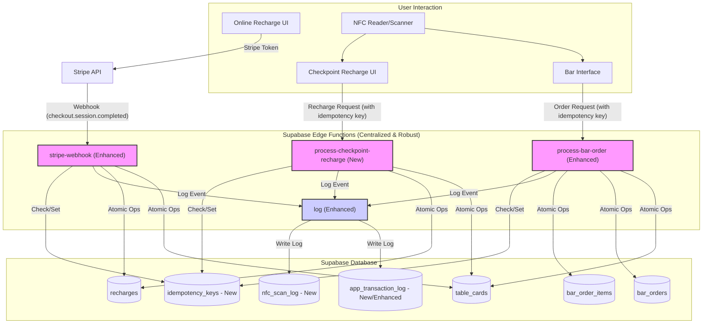

# Comprehensive Improvement Plan for Cashless NFC Festival System

This plan aims to address identified weaknesses in the cashless NFC festival system by focusing on robust, atomic, and idempotent operations, enhanced NFC handling, comprehensive monitoring, thorough documentation, and rigorous testing, culminating in a full-scale simulation.

## 1. Deep Analysis Summary (Recap)

The existing system has made initial strides in centralizing logic with Edge Functions. However, critical gaps remain concerning:
*   **Atomicity:** Lack of atomic operations in bar order processing ([`supabase/functions/process-bar-order/index.ts`](supabase/functions/process-bar-order/index.ts:1)) and Stripe webhook ([`supabase/functions/stripe-webhook/index.ts`](supabase/functions/stripe-webhook/index.ts:1)).
*   **Idempotency:** Insufficient mechanisms to prevent duplicate processing beyond the basic Stripe session ID check.
*   **NFC Handling:** Client-side debouncing ([`src/hooks/use-nfc.tsx`](src/hooks/use-nfc.tsx:1)) is basic and needs backend reinforcement.
*   **Logging & Monitoring:** The [`supabase/functions/log/index.ts`](supabase/functions/log/index.ts:1) function requires significant expansion.
*   **Checkpoint Recharges:** Backend logic for staff-assisted NFC recharges is undefined.

## 2. Revised Comprehensive Improvement Plan

### 2.1. Card Recharge Robustness

#### 2.1.1. Online Stripe Recharges (via [`supabase/functions/stripe-webhook/index.ts`](supabase/functions/stripe-webhook/index.ts:1))

*   **Goal:** Ensure atomic, idempotent, and reliably logged Stripe recharges, with comprehensive documentation and testing.
*   **Actions:**
    1.  **Atomicity & Idempotency Enhancement:**
        *   Modify function to use Supabase DB transaction (PostgreSQL function `sp_process_stripe_recharge`) for atomic operations:
            *   Verify `stripe_session_id` against `idempotency_keys`.
            *   Read card balance.
            *   Update balance in `table_cards`.
            *   Insert into `recharges`.
            *   Log to `app_transaction_log`.
    2.  **Error Handling:** Distinguish transient vs. permanent errors.
    3.  **Metadata:** Store all necessary Stripe metadata in `recharges`.
    4.  **Documentation:**
        *   Update [`README.md`](README.md:1) on Stripe integration.
        *   API spec for `stripe-webhook` Edge Function.
        *   Document `sp_process_stripe_recharge` stored procedure.
    5.  **Testing (Phase-Specific):**
        *   **Unit Tests:** For `sp_process_stripe_recharge`.
        *   **Integration Tests:** For `stripe-webhook` Edge Function (enhance [`supabase/functions/__tests__/stripe-webhook.test.ts`](supabase/functions/__tests__/stripe-webhook.test.ts:1)).
        *   **Functional Tests:** Manual Stripe test payments.

#### 2.1.2. Checkpoint NFC Recharges

*   **Goal:** Implement a new, robust, well-documented, and tested Edge Function for staff-assisted NFC card recharges.
*   **Actions:**
    1.  **New Edge Function (`process-checkpoint-recharge`):**
        *   **Input:** `card_id`, `recharge_amount`, `payment_method_at_checkpoint`, `staff_id`, `checkpoint_id`, `client_request_id`.
        *   **Atomicity & Idempotency:** Use Supabase DB transaction (PostgreSQL function `sp_process_checkpoint_recharge`).
    2.  **Frontend ([`src/pages/RechargePage.tsx`](src/pages/RechargePage.tsx:1) & [`CardTopup`](src/components/admin/CardTopup.tsx:1)):**
        *   Generate and send `client_request_id`.
    3.  **Documentation:**
        *   Update [`README.md`](README.md:1) for checkpoint recharge flow.
        *   API spec for `process-checkpoint-recharge` Edge Function.
        *   Document `sp_process_checkpoint_recharge` stored procedure.
        *   Update [`CardTopup`](src/components/admin/CardTopup.tsx:1) documentation.
    4.  **Testing (Phase-Specific):**
        *   **Unit Tests:** For `sp_process_checkpoint_recharge`.
        *   **Integration Tests:** For `process-checkpoint-recharge` Edge Function.
        *   **Functional Tests:** Manual checkpoint recharges on [`RechargePage`](src/pages/RechargePage.tsx:1).

### 2.2. NFC Interaction Refinement

*   **Goal:** Make NFC interactions more resilient, with clearer feedback, robust logging, comprehensive documentation, and thorough testing.
*   **Actions:**
    1.  **Backend Debouncing/Throttling:** Implement short-lived backend lock/flag for `card_id` in stored procedures.
    2.  **Enhanced Client-Side NFC Handling ([`src/hooks/use-nfc.tsx`](src/hooks/use-nfc.tsx:1)):**
        *   Stricter card ID tracking with timestamps.
        *   Robust state machine (`IDLE`, `SCANNING`, `VALIDATING_CARD`, `PROCESSING_OPERATION`, `COOLDOWN`).
        *   Clearer UI feedback.
    3.  **NFC Scan Logging:** Enhance [`log`](supabase/functions/log/index.ts:1) function to capture all raw NFC scan events to `nfc_scan_log`.
    4.  **Documentation:**
        *   Update [`README.md`](README.md:1) on NFC features and debouncing.
        *   Document state machine in [`use-nfc.tsx`](src/hooks/use-nfc.tsx:1).
        *   Specify `nfc_scan_log` table structure.
    5.  **Testing (Phase-Specific):**
        *   **Unit Tests:** For state machine logic in [`use-nfc.tsx`](src/hooks/use-nfc.tsx:1).
        *   **Integration Tests:** NFC scan data flow to `nfc_scan_log`; backend debouncing.
        *   **Functional Tests:** Various NFC scan scenarios, verify UI and logs.

### 2.3. Bar Operations Review ([`supabase/functions/process-bar-order/index.ts`](supabase/functions/process-bar-order/index.ts:1))

*   **Goal:** Ensure bar orders are processed atomically, idempotently, are well-documented, and rigorously tested.
*   **Actions:**
    1.  **Atomicity & Idempotency Enhancement:**
        *   Replace sequential DB operations with call to `sp_process_bar_order` stored procedure.
    2.  **Client-Side:** Bar interface to generate and send `client_request_id`.
    3.  **Input Validation:** Enhance in Edge Function and/or stored procedure.
    4.  **Documentation:**
        *   Update [`README.md`](README.md:1) on Bar Operations.
        *   API spec for `process-bar-order` Edge Function.
        *   Document `sp_process_bar_order` stored procedure.
    5.  **Testing (Phase-Specific):**
        *   **Unit Tests:** For `sp_process_bar_order`.
        *   **Integration Tests:** For `process-bar-order` Edge Function.
        *   **Functional Tests:** Process bar orders via UI, verify balances and logs.

### 2.4. Production Monitoring & Resilience

*   **Goal:** Establish robust, well-documented, and tested monitoring, alerting, and resilience mechanisms.
*   **Actions:**
    1.  **Enhanced Logging ([`supabase/functions/log/index.ts`](supabase/functions/log/index.ts:1) & `app_transaction_log`):**
        *   Expand [`log`](supabase/functions/log/index.ts:1) function; use `app_transaction_log` for full financial transaction lifecycle.
    2.  **Anomaly Detection:** Implement Supabase DB functions/jobs for unusual balance changes, orphaned orders, etc.
    3.  **Database Consistency Checks:** Regular scheduled integrity checks.
    4.  **Alerts:** For high error rates, anomalies, consistency failures, critical errors.
    5.  **User Feedback & Retry Protection (Client-Side):**
        *   Confirmation for large operations.
        *   Intelligent client-side retry logic with same `client_request_id`.
    6.  **Documentation:**
        *   Document `app_transaction_log` and `nfc_scan_log` structure.
        *   Document logging strategy, anomaly detection rules, consistency checks, alerting setup.
    7.  **Testing (Phase-Specific):**
        *   **Unit Tests:** For new DB functions (anomaly detection, consistency).
        *   **Integration Tests:** Verify logging by Edge Functions; test anomaly detection and alerting.
        *   **Functional Tests:** Review logs; manually introduce inconsistencies to test checks.

### 2.5. Supabase Database Schema Evolution

*   **Goal:** Update database schema to support architectural changes, with clear documentation.
*   **Actions:**
    1.  **New Table: `idempotency_keys`**
        *   `request_id` (TEXT, PRIMARY KEY)
        *   `source_function` (TEXT)
        *   `status` (TEXT)
        *   `response_payload` (JSONB, nullable)
        *   `created_at` (TIMESTAMPTZ, default now())
        *   `updated_at` (TIMESTAMPTZ, default now())
    2.  **New Table: `app_transaction_log`**
        *   `log_id` (BIGSERIAL, PRIMARY KEY)
        *   `transaction_id` (UUID, UNIQUE)
        *   `correlation_id` (UUID, nullable)
        *   `card_id` (TEXT, indexed, foreign key to `table_cards.id`)
        *   `transaction_type` (TEXT)
        *   `status` (TEXT)
        *   `amount_involved` (DECIMAL(10, 2))
        *   `previous_balance_on_card` (DECIMAL(10, 2), nullable)
        *   `new_balance_on_card` (DECIMAL(10, 2), nullable)
        *   `details` (JSONB, nullable)
        *   `edge_function_name` (TEXT)
        *   `edge_function_request_id` (TEXT)
        *   `client_request_id` (TEXT, nullable)
        *   `timestamp` (TIMESTAMPTZ, default now(), indexed)
    3.  **New Table: `nfc_scan_log`**
        *   `scan_log_id` (BIGSERIAL, PRIMARY KEY)
        *   `card_id_scanned` (TEXT, nullable)
        *   `raw_data_if_any` (TEXT, nullable)
        *   `scan_timestamp` (TIMESTAMPTZ, default now(), indexed)
        *   `scan_status` (TEXT)
        *   `scan_location_context` (TEXT)
        *   `device_identifier` (TEXT, nullable)
        *   `user_agent_performing_scan` (TEXT, nullable)
    4.  **Modifications to `recharges` Table:**
        *   Add `staff_id` (TEXT, nullable), `checkpoint_id` (TEXT, nullable), `client_request_id` (TEXT, nullable, unique).
        *   Ensure `stripe_session_id` has UNIQUE constraint.
    5.  **Modifications to `bar_orders` Table:**
        *   Add `client_request_id` (TEXT, nullable, unique).
    6.  **Stored Procedures/Database Functions:**
        *   `sp_process_bar_order(card_id_in TEXT, items_in JSONB, total_amount_in DECIMAL, client_request_id_in TEXT, point_of_sale_in INT)`
        *   `sp_process_stripe_recharge(card_id_in TEXT, amount_in DECIMAL, stripe_session_id_in TEXT, stripe_metadata_in JSONB)`
        *   `sp_process_checkpoint_recharge(card_id_in TEXT, amount_in DECIMAL, payment_method_in TEXT, staff_id_in TEXT, client_request_id_in TEXT)`
    7.  **Documentation:**
        *   Update [`schema.sql`](schema.sql:1) or create migration scripts.
        *   Update [`README.md`](README.md:1) "Database Structure" section.
        *   Create/update data dictionary.
        *   Document all new stored procedures.
    8.  **Testing (Phase-Specific):**
        *   **Schema Validation:** Verify schema changes post-migration.
        *   **Stored Procedure Tests:** Unit test each stored procedure.

### 2.6. Full Festival Simulation Test (New Final Phase)

*   **Goal:** Meticulously verify correctness of all system operations, card balance integrity, and overall system resilience under realistic, high-load festival conditions. Enhances existing tests in [`load-tests/`](load-tests/:1).
*   **Actions:**
    1.  **Test Scenario Design & Enhancement:**
        *   Review existing K6 scripts.
        *   Design new comprehensive scenarios simulating entire festival lifecycle (initial loads, concurrent bar ops, intermittent recharges, diverse orders, simulated double scans/retries).
    2.  **Test Data Preparation:** Significant set of test cards, product lists.
    3.  **Environment Setup:** Dedicated, production-like Supabase environment; full monitoring active.
    4.  **Execution & Monitoring:** Run enhanced K6 suite, monitor Supabase resources, Edge Function performance, DB query performance, logs (`app_transaction_log`, `nfc_scan_log`, `idempotency_keys`).
    5.  **Verification & Validation:**
        *   **Card Balance Integrity:** Full reconciliation of all card balances (automated).
        *   **Transaction Completeness:** Verify all operations recorded correctly.
        *   **Idempotency Verification:** Confirm duplicate requests handled correctly.
        *   **Error Handling:** Analyze errors, identify root causes.
    6.  **Documentation:**
        *   Document "Full Festival Simulation Test" plan (scenarios, load profiles, expected outcomes).
        *   Record execution parameters, observations, issues.
        *   Produce final test report (balance integrity, transaction correctness, performance). Update/create [`load-tests/README.md`](load-tests/README.md:1).
    7.  **Iteration:** Address issues and re-run simulation until satisfactory.