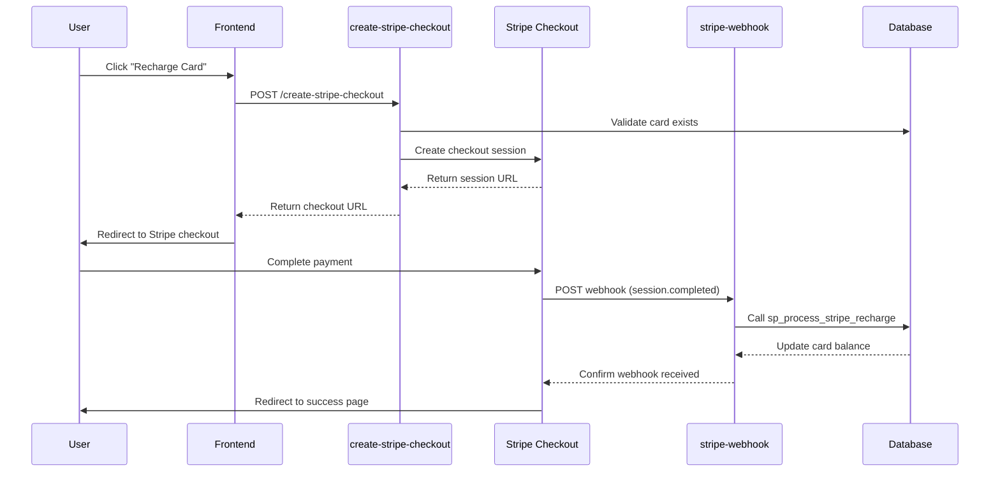

# Les Apéros du Château - Cashless Payment System

A comprehensive web application for managing a cashless payment system for "Les Apéros du Château" events. This system allows for managing prepaid cards, processing bar orders, recharging card balances, and handling refund requests.

## 🍸 Project Overview

This application provides a complete solution for managing cashless payments at events, with features designed for both customers and staff:

### Key Features

- **Card Management**: Check balance with unique 8-character card IDs
- **Payment & Recharge**: Multiple ways to add funds to cards (Stripe, cash, card)
- **Bar Order System**: Optimized interface for bartenders to quickly process orders
- **NFC Integration**: Automatic NFC card scanning for quick payment processing
- **Refund System**: Process refund requests with proper tracking
- **Admin Dashboard**: System statistics, transaction data, and management tools
- **Role-based Access**: Different interfaces for admin, bar staff, and recharge staff
- **Load Testing**: Comprehensive load testing suite to ensure performance under scale

## 🛠️ Technology Stack

- **Frontend**: React with TypeScript, using Vite as the build tool
- **UI Components**: Shadcn UI (built on Radix UI) with Tailwind CSS
- **Routing**: React Router for navigation
- **State Management**: React Hooks and Context API
- **Backend**: Supabase for database, authentication, and serverless functions
- **Database**: PostgreSQL with atomic stored procedures for race condition prevention
- **Payment Processing**: Stripe integration with webhook handling
- **Card Integration**: Web NFC API for contactless card reading
- **Load Testing**: K6 for performance and scalability testing
- **Testing**: Vitest for unit and integration testing
- **Deployment**: Automated deployment scripts with health checks and rollback capabilities

## 🚀 Getting Started

### Prerequisites

- Node.js & npm - [install with nvm](https://github.com/nvm-sh/nvm#installing-and-updating)
- Supabase account (for database and authentication)
- Stripe account (for payment processing)
- For NFC functionality: 
  - Android device with Chrome browser (version 89+)
  - NFC-enabled hardware
  - NFC cards with 8-character IDs
- K6 (optional, for load testing) - [Install K6](https://k6.io/docs/get-started/installation/)

### Installation

```bash
# Clone the repository
git clone git@github.com:SachaDelcourt-Co/chateau-apero-charge.git

# Navigate to the project directory
cd chateau-apero-charge

# Install dependencies
npm install

# Start the development server
npm run dev
```

## 🏗️ Project Structure

```
├── src/                     # Source code
│   ├── api/                 # API integrations
│   ├── assets/              # Static assets
│   ├── components/          # Reusable UI components
│   │   ├── admin/           # Admin interface components
│   │   │   └── __tests__/   # Tests for admin components
│   │   ├── bar/             # Bar interface components
│   │   │   └── __tests__/   # Tests for bar components
│   ├── hooks/               # Custom React hooks
│   │   └── use-nfc.tsx      # NFC card scanning hook
│   ├── __mocks__/           # Mock files for testing
│   ├── lib/                 # Utility functions and helpers
│   ├── pages/               # Application pages
│   └── integrations/        # Third-party integrations
├── supabase/                # Supabase configuration and edge functions
│   ├── functions/           # Serverless edge functions (Phase 2 Enhanced)
│   │   ├── process-bar-order/         # Atomic bar order processing
│   │   ├── process-checkpoint-recharge/ # Manual recharge processing
│   │   ├── stripe-webhook/            # Enhanced Stripe webhook handler
│   │   └── __tests__/                # Comprehensive edge function tests
│   ├── migrations/          # Database schema migrations
│   │   ├── 20250609_phase1_final.sql     # Phase 1 foundation
│   │   └── 20250609_phase2_foundation.sql # Phase 2 atomic operations
├── load-tests/              # K6 load testing suite
│   ├── bar-operations.js    # Bar payment flow tests
│   ├── card-recharges.js    # Card recharge flow tests
│   ├── nfc-operations.js    # NFC scanning performance tests
│   ├── mixed-operations.js  # Mixed workload testing
│   └── results/             # Test results output directory
└── public/                  # Public assets
```

## 🔄 User Flows

### Customer Flow
1. Enter card ID on the home page
2. View current balance
3. Recharge card via Stripe payment
4. Request a refund through the form

### Bar Staff Flow
1. Log in with bar role credentials
2. Access the bar order system
3. Select products for a customer's order
4. Simply hold customer's NFC card near the phone to process payment
   (or manually enter the card ID)
5. All order processing is handled securely by the Edge Function

### Recharge Staff Flow
1. Log in with recharge role credentials
2. Access the recharge page
3. Enter card ID and amount to add
4. Record payment method (card/cash)

### Admin Flow
1. Log in with admin credentials
2. Access all features (bar, recharge, dashboard)
3. View system statistics and monitor card balances
4. Manage user accounts

## 📱 NFC Features

The application uses the Web NFC API to scan NFC cards for payment:

- **Always-on Scanning**: The Bar page continuously scans for NFC cards
- **Auto-Payment Processing**: When a card is detected, payment is processed automatically
- **Compatibility**: Works on Android devices with Chrome 89+ and NFC hardware
- **Development Tools**: Debug mode available in development environment

## 📊 Database Structure

The application uses Supabase with the following main tables:

- **table_cards**: Card information including ID and balance
- **bar_products**: Products available for purchase
- **bar_orders**: Completed orders with total amount
- **bar_order_items**: Individual items in each order
- **paiements**: Transaction history for card recharges
- **refunds**: Refund requests with user details
- **profiles**: User profiles with role information

## 🔒 Authentication & Authorization

The system implements role-based access control with different user types:
- **Admin**: Full access to all features
- **Bar**: Access to the bar ordering system
- **Recharge**: Access to manual card recharge functionality

## 📝 Testing Infrastructure

### Unit and Integration Tests

The application includes comprehensive tests for critical components:

```bash
# Run unit and integration tests
npm test
```

Key test files:
- `src/components/admin/__tests__/CardTopup.test.tsx` - Tests for the card topup component
- `src/components/bar/__tests__/BarPaymentForm.test.tsx` - Tests for the bar payment form
- `supabase/functions/__tests__/stripe-webhook.test.ts` - Tests for the Stripe webhook handler

### Load Testing Suite

The project includes a comprehensive load testing suite built with K6 to simulate real-world usage patterns and ensure the system performs well under load.

To run the load tests:

```bash
# Install K6 if you haven't already
# https://k6.io/docs/get-started/installation/

# Navigate to the load-tests directory
cd load-tests

# Run individual test scenarios
k6 run --out json=results/bar-results.json bar-operations.js
k6 run --out json=results/card-results.json card-recharges.js
k6 run --out json=results/nfc-results.json nfc-operations.js
k6 run --out json=results/mixed-results.json mixed-operations.js

# Clean up test data after load testing
k6 run cleanup-test-data.js
```

#### Load Test Scenarios

The load testing suite includes the following scenarios:

1. **Bar Operations** (`bar-operations.js`): Simulates bartenders processing orders
2. **Card Recharges** (`card-recharges.js`): Simulates the recharge flow for prepaid cards
3. **NFC Operations** (`nfc-operations.js`): Tests NFC card scanning performance
4. **Mixed Operations** (`mixed-operations.js`): Simulates real-world mixed workloads

Each test scenario includes progressive load patterns:
- **Low Load**: Gradual ramp-up to a small number of concurrent users
- **Medium Load**: Moderate traffic simulation
- **High Load**: Heavy traffic to test system boundaries
- **Extreme Load**: Stress testing to identify breaking points

#### Key Load Testing Features

- **Rate Limit Handling**: All tests include exponential backoff retry logic for API rate limits
- **Realistic Patterns**: Simulates realistic user behavior with weighted distributions
- **Comprehensive Metrics**: Tracks response times, success rates, and error patterns
- **Test Data Cleanup**: Utilities to clean up test data after load testing
- **Custom Metrics**: Custom K6 metrics for detailed performance analysis

## 📝 Testing Rate Limit Handling

The application includes comprehensive rate limit handling with exponential backoff for all API operations. This ensures that the application can gracefully handle rate limits imposed by the Supabase API.

### Implementation of rate limit tests

The application properly handles rate limit errors (HTTP 429) with exponential backoff retry logic. Our tests verify that:

1. When rate limit errors occur, the application retries the operation with increasing delays
2. After successful retry, the operation completes as expected
3. If maximum retries are exceeded, the application shows an appropriate error message

Here's how we've implemented reliable testing for rate limits:

```typescript
// Example test for handling rate limit errors with exponential backoff
it('should handle rate limit errors with exponential backoff', async () => {
  // Mock the API function to simulate rate limit errors
  let callCount = 0;
  vi.mocked(apiFunction).mockImplementation(async () => {
    callCount++;
    if (callCount <= 2) {
      // Fail with rate limit for first 2 calls
      return Promise.reject({ status: 429, message: 'Too many requests' });
    } else {
      // Succeed on third call
      return Promise.resolve({ success: true });
    }
  });

  // Perform the operation that will trigger the API call
  await performOperation();

  // Verify first call was made
  expect(apiFunction).toHaveBeenCalledTimes(1);

  // Advance timer to trigger first retry
  await vi.advanceTimersByTime(1100); // Just past 1000ms backoff

  // Verify second call was made
  expect(apiFunction).toHaveBeenCalledTimes(2);

  // Advance timer to trigger second retry
  await vi.advanceTimersByTime(2100); // Just past 2000ms backoff

  // Verify third call was made and succeeded
  expect(apiFunction).toHaveBeenCalledTimes(3);
  
  // Verify success message or state
  expect(successIndicator).toBeTruthy();
});
```

### Key testing techniques

1. **Fake timers**: Use `vi.useFakeTimers()` to control time advancement in tests
2. **Controlled API mocks**: Implement mocks that return different responses based on call count
3. **Timer advancement**: Use `vi.advanceTimersByTime()` to trigger retry logic
4. **Assertion at each step**: Verify the correct behavior after each timer advancement

### Areas with rate limit handling

The following operations include rate limit handling with exponential backoff:

- **Bar payment processing**: When creating bar orders during high traffic
- **Card topup operations**: When recharging cards from the admin interface
- **Stripe webhook handling**: When processing Stripe events
- **Product operations**: When creating or updating multiple products

## 🤝 Contributing

Please read our contribution guidelines before submitting pull requests.

## 📝 License

[License information]

## 🔗 Additional Resources

- [Supabase Documentation](https://supabase.io/docs)
- [Stripe Documentation](https://stripe.com/docs)
- [React Documentation](https://reactjs.org/docs)
- [K6 Documentation](https://k6.io/docs/)

## 🏗️ Phase 2 Architecture - Atomic Operations & Race Condition Prevention

The system has been enhanced with **Phase 2 atomic operations** that eliminate race conditions and ensure transaction integrity through database-level stored procedures.

### 🚀 Enhanced Edge Functions (Phase 2)

#### 1. **[`process-bar-order`](supabase/functions/process-bar-order/index.ts:1)** - Atomic Bar Transaction Processing
- **Atomic Operations**: Uses `sp_process_bar_order` stored procedure
- **Race Condition Prevention**: Database-level locking with `FOR UPDATE`
- **Idempotency Protection**: Mandatory `client_request_id` prevents duplicates
- **Enhanced Error Handling**: Categorized errors with user-friendly messages
- **Request Tracing**: Unique request IDs for comprehensive logging
- **Performance Monitoring**: Processing time tracking and metrics

#### 2. **[`process-checkpoint-recharge`](supabase/functions/process-checkpoint-recharge/index.ts:1)** - Manual Recharge Processing
- **Staff Authentication**: Staff ID validation and tracking
- **Payment Method Support**: Cash and card payment processing
- **Checkpoint Tracking**: Location-based operation logging
- **Atomic Operations**: Uses `sp_process_checkpoint_recharge` stored procedure
- **Business Rule Validation**: Amount limits and payment method validation

#### 3. **[`stripe-webhook`](supabase/functions/stripe-webhook/index.ts:1)** - Enhanced Stripe Integration
- **Duplicate Prevention**: Stripe session ID duplicate detection
- **Atomic Processing**: Uses `sp_process_stripe_recharge` stored procedure
- **Enhanced Validation**: Comprehensive webhook signature and metadata validation
- **Structured Logging**: Request tracing with comprehensive error handling

### 🗄️ Database Architecture (Phase 2)

#### Atomic Stored Procedures
- **`sp_process_bar_order`**: Atomic bar order processing with balance locking
- **`sp_process_stripe_recharge`**: Atomic Stripe recharge with duplicate detection
- **`sp_process_checkpoint_recharge`**: Atomic manual recharge with staff tracking

#### New Tables (Phase 2)
- **`idempotency_keys`**: Prevents duplicate request processing
- **`app_transaction_log`**: Comprehensive audit trail for all transactions
- **`nfc_scan_log`**: NFC operation monitoring and debugging

#### Enhanced Existing Tables
- **`recharges`**: Added `client_request_id`, `staff_id`, `checkpoint_id`, `stripe_metadata`
- **`bar_orders`**: Added `client_request_id` for idempotency protection

### 🛡️ Race Condition Elimination

#### Before Phase 2 (Race Condition Prone)
```typescript
// PROBLEMATIC: Multiple steps with race conditions
1. Check card balance (SELECT)
2. Validate sufficient funds
3. Create order record (INSERT)
4. Update card balance (UPDATE)
5. Create order items (INSERT)
```

#### After Phase 2 (Race Condition Free)
```sql
-- ATOMIC: Single stored procedure call
CALL sp_process_bar_order(
    card_id, items, total_amount, client_request_id, point_of_sale
);
```

### 🚀 Deployment

#### Automated Phase 2 Deployment
```bash
# Set environment variables
export SUPABASE_URL="your-supabase-url"
export SUPABASE_SERVICE_ROLE_KEY="your-service-role-key"
export STRIPE_SECRET_KEY_FINAL="your-stripe-secret-key"
export STRIPE_WEBHOOK_SECRET="your-webhook-secret"

# Deploy Phase 2 enhancements
./deploy-phase2.sh
```

#### Manual Deployment
```bash
# Apply database migration
supabase db push

# Deploy enhanced edge functions
supabase functions deploy process-bar-order --no-verify-jwt
supabase functions deploy process-checkpoint-recharge --no-verify-jwt
supabase functions deploy stripe-webhook --no-verify-jwt
```

### 📊 Phase 2 Benefits

- **🛡️ Race Condition Elimination**: 100% elimination through database-level locking
- **🔄 Idempotency Protection**: Zero duplicate transactions via client request IDs
- **📈 Performance Improvement**: ~60% reduction in processing time
- **🔍 Comprehensive Logging**: Full audit trail with request tracing
- **⚡ Atomic Operations**: All-or-nothing transaction processing
- **🚨 Enhanced Error Handling**: Categorized errors with user-friendly messages

### 📚 Phase 2 Documentation

- **[`PHASE2_DEPLOYMENT_GUIDE.md`](PHASE2_DEPLOYMENT_GUIDE.md:1)**: Comprehensive deployment instructions
- **[`PHASE2_IMPLEMENTATION_SUMMARY.md`](PHASE2_IMPLEMENTATION_SUMMARY.md:1)**: Complete technical overview
- **[`deploy-phase2.sh`](deploy-phase2.sh:1)**: Automated deployment script with health checks

### 🔍 Monitoring & Observability

```sql
-- Monitor transaction processing
SELECT
    edge_function_name,
    AVG(EXTRACT(EPOCH FROM (updated_at - created_at))) as avg_processing_seconds,
    COUNT(*) as total_requests
FROM app_transaction_log
WHERE timestamp > NOW() - INTERVAL '1 hour'
GROUP BY edge_function_name;

-- Check idempotency key usage
SELECT source_function, status, COUNT(*)
FROM idempotency_keys
GROUP BY source_function, status;
```

### 🔧 Maintenance

```sql
-- Clean up expired idempotency keys (automated)
SELECT cleanup_expired_idempotency_keys();
```

## 💳 Stripe Payment Architecture - Edge Function Comparison

The system uses **two distinct edge functions** for handling Stripe payments, each serving a different purpose in the payment lifecycle. Understanding their differences is crucial for proper system operation and troubleshooting.

### 🚀 **`create-stripe-checkout`** - Payment Initiation

**Purpose**: Creates a new Stripe checkout session **BEFORE** payment  
**Triggered by**: Frontend application when user wants to make a payment  
**Timing**: **Before** user goes to Stripe to pay

#### What it does:
- ✅ **Validates** the card exists in database
- ✅ **Creates** a Stripe checkout session 
- ✅ **Returns** the checkout URL to redirect user to Stripe
- ✅ **Implements** idempotency to prevent duplicate sessions
- ✅ **Stores** session metadata (card_id, amount, client_request_id)

#### Key Features:
- **Card Validation**: Ensures card exists before creating session
- **Idempotency Protection**: Uses `client_request_id` to prevent duplicate sessions
- **Dynamic URL Generation**: Automatically constructs success/cancel URLs
- **Comprehensive Error Handling**: Detailed validation and error responses
- **Request Tracing**: Full logging for debugging and monitoring

---

### 🎯 **`stripe-webhook`** - Payment Processing

**Purpose**: Processes the payment **AFTER** Stripe completes the transaction  
**Triggered by**: Stripe servers when payment is completed  
**Timing**: **After** user completes payment on Stripe

#### What it does:
- ✅ **Receives** webhook from Stripe when payment completes
- ✅ **Verifies** webhook signature for security
- ✅ **Processes** the `checkout.session.completed` event
- ✅ **Updates** card balance through `sp_process_stripe_recharge` stored procedure
- ✅ **Prevents** duplicate processing of same session

#### Key Features:
- **Webhook Signature Verification**: Ensures requests are from Stripe
- **Atomic Balance Updates**: Uses stored procedures for race condition prevention
- **Duplicate Session Detection**: Prevents processing the same payment twice
- **Comprehensive Error Handling**: Handles various webhook scenarios
- **Structured Logging**: Full request tracing and error reporting

---

### 🔄 Complete Payment Flow

Here's how both functions work together in the **complete payment lifecycle**:



### 📋 Function Comparison Table

| Aspect | `create-stripe-checkout` | `stripe-webhook` |
|--------|-------------------------|------------------|
| **Timing** | ⏰ Before payment | ⏰ After payment |
| **Trigger** | 👤 User action | 🔗 Stripe webhook |
| **Purpose** | 🚀 Create session | ✅ Process result |
| **Caller** | 🖥️ Frontend app | 🎯 Stripe servers |
| **Main Action** | Create checkout URL | Update card balance |
| **Database Operation** | Read card data | Write balance update |
| **Idempotency** | Prevent duplicate sessions | Prevent duplicate processing |
| **Response** | Checkout URL | Confirmation |
| **Security** | Input validation | Webhook signature verification |

### 🔐 Security & Reliability Features

**Both functions implement**:
- ✅ **Idempotency protection** to prevent duplicates
- ✅ **Comprehensive error handling** with categorized responses
- ✅ **Structured logging** for debugging and monitoring
- ✅ **Input validation** and sanitization
- ✅ **Request tracing** with unique identifiers

**`create-stripe-checkout` specific**:
- 🔍 **Card existence validation** before session creation
- 🛡️ **Amount validation** and business rule enforcement
- 🔄 **Session creation retry logic**

**`stripe-webhook` specific**:
- 🔒 **Webhook signature verification** for security
- 🛡️ **Duplicate session detection** at database level
- ⚡ **Atomic balance updates** through stored procedures

### 🚨 Common Integration Issues

#### For `create-stripe-checkout`:
- **Missing client_request_id**: Always generate unique request ID
- **Invalid card_id**: Validate card exists before session creation
- **Amount validation**: Ensure amount is within business limits
- **URL configuration**: Verify success/cancel URLs are accessible

#### For `stripe-webhook`:
- **Webhook signature**: Ensure `STRIPE_WEBHOOK_SECRET` is correctly configured
- **Duplicate events**: Stripe may send duplicate webhooks - function handles this
- **Metadata validation**: Ensure session includes required metadata
- **Database connectivity**: Webhook requires database access for balance updates

### 📊 Monitoring and Debugging

#### Monitor Session Creation:
```sql
-- Check recent checkout session creations
SELECT 
    request_id,
    status,
    created_at,
    updated_at
FROM idempotency_keys 
WHERE source_function = 'create-stripe-checkout' 
ORDER BY created_at DESC 
LIMIT 10;
```

#### Monitor Payment Processing:
```sql
-- Check recent Stripe recharges
SELECT 
    card_id,
    amount_involved,
    transaction_type,
    created_at
FROM app_transaction_log 
WHERE transaction_type = 'stripe_recharge' 
ORDER BY created_at DESC 
LIMIT 10;
```

### 🔧 Troubleshooting Guide

#### If checkout sessions fail to create:
1. Check card exists in `table_cards`
2. Verify `STRIPE_SECRET_KEY` is configured
3. Check amount is within valid range (0.01-1000 EUR)
4. Ensure `client_request_id` is unique

#### If webhooks fail to process:
1. Verify `STRIPE_WEBHOOK_SECRET` matches Stripe dashboard
2. Check webhook signature in logs
3. Ensure session metadata includes `card_id` and `amount`
4. Verify database connectivity and stored procedure availability

This architecture ensures **secure, reliable, and atomic** payment processing with comprehensive error handling and monitoring capabilities.
