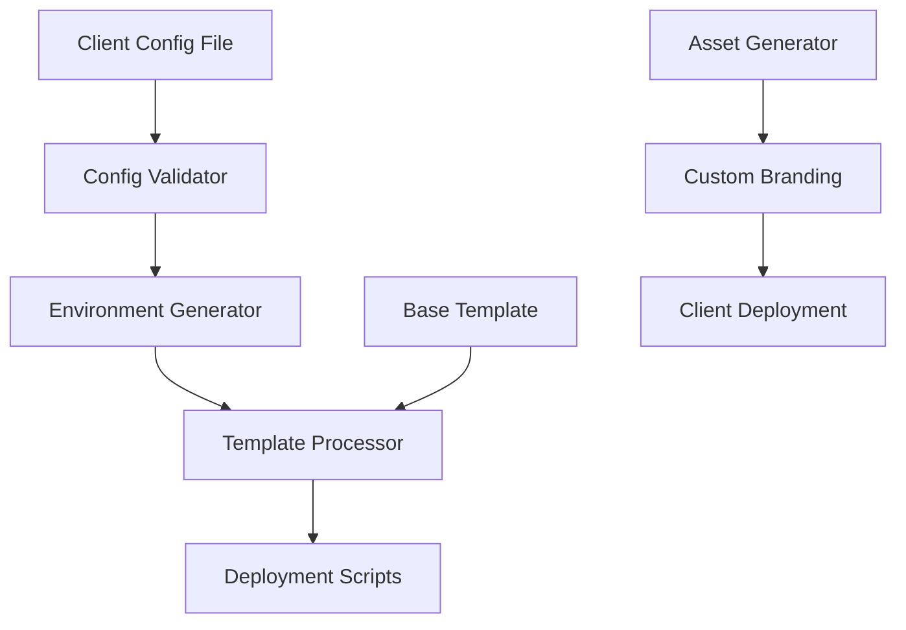

# Commercialization Implementation Plan
## "Les Apéros du Château" → Configurable Event Management Template

**Document Version**: 1.0  
**Created**: July 24, 2025  
**Project Start**: September 2025  
**Target Completion**: November 2025 (2 months)  
**Team**: 1 Full-stack Developer + AI Coding Assistant

---

## 🎯 Executive Summary

This plan transforms the "Les Apéros du Château" single-client NFC cashless payment system into a configurable template product that can be rapidly deployed for new event organizers. The hybrid approach maintains the proven single-tenant architecture while introducing comprehensive configuration management and automated deployment capabilities.

### Key Objectives
- **Eliminate 82+ hardcoded client references** identified in code review
- **Create configuration-driven deployment system** for rapid client onboarding
- **Maintain security and performance** while adding flexibility
- **Establish standardized deployment pipeline** with dedicated infrastructure per client

### Success Metrics
- **Deployment Time**: New client setup in < 4 hours (vs current weeks)
- **Configuration Coverage**: 100% of client-specific elements configurable
- **Code Reusability**: 95%+ shared codebase across deployments
- **Security**: Zero exposed credentials or client data leakage

---

## 📊 Current State Analysis

### Critical Issues Identified

| Category | Issues Found | Impact | Priority |
|----------|--------------|---------|----------|
| **Hardcoded References** | 82+ client-specific strings | High | Critical |
| **Security Vulnerabilities** | Exposed credentials in code | Critical | Critical |
| **Configuration Management** | No centralized config system | High | High |
| **Deployment Process** | Manual, error-prone setup | Medium | High |
| **Branding System** | Hardcoded UI elements | Medium | Medium |

### Architecture Strengths to Preserve
- ✅ **Atomic transaction processing** via stored procedures
- ✅ **Race condition prevention** with database-level locking
- ✅ **Comprehensive error handling** and logging
- ✅ **NFC integration** with Web NFC API
- ✅ **Real-time monitoring** capabilities
- ✅ **Stripe payment integration**

---

## 🏗️ Implementation Strategy

### Hybrid Single-Tenant Approach
- **Dedicated infrastructure** per client (separate Supabase projects, domains)
- **Shared codebase** with configuration-driven customization
- **Automated deployment** with standardized scripts
- **Environment-based configuration** management

### Technology Stack Preservation
- **Frontend**: React + TypeScript + Tailwind CSS
- **Backend**: Supabase (PostgreSQL + Edge Functions)
- **Payments**: Stripe integration
- **Deployment**: Automated scripts + Docker containers
- **Configuration**: JSON/YAML-based config files

---

## 📋 Detailed Implementation Plan

## Phase 1: Configuration Foundation (Week 1-2)
**Duration**: 10 days  
**Effort**: 60-80 hours

### 1.1 Configuration System Architecture
**Effort**: 16 hours



**Tasks**:
- Create [`config/client-config.schema.json`](config/client-config.schema.json:1) - JSON schema for validation
- Implement [`src/lib/config-manager.ts`](src/lib/config-manager.ts:1) - Configuration loading and validation
- Design [`config/templates/client-template.json`](config/templates/client-template.json:1) - Base configuration template

**Deliverables**:
- Configuration schema with 50+ configurable parameters
- Type-safe configuration interfaces
- Runtime configuration validation

### 1.2 Environment Variable Management
**Effort**: 12 hours

**Tasks**:
- Audit all hardcoded values in codebase
- Create [`scripts/generate-env.js`](scripts/generate-env.js:1) - Environment file generator
- Implement [`src/lib/env-config.ts`](src/lib/env-config.ts:1) - Environment variable loader

**Deliverables**:
- Complete inventory of configurable parameters
- Automated `.env` file generation
- Environment-specific configuration loading

### 1.3 Database Configuration System
**Effort**: 20 hours

**Tasks**:
- Create [`supabase/migrations/001_configuration_tables.sql`](supabase/migrations/001_configuration_tables.sql:1)
- Implement [`supabase/functions/config-loader/index.ts`](supabase/functions/config-loader/index.ts:1)
- Update stored procedures for dynamic configuration

**Deliverables**:
- `client_configuration` table with versioning
- Dynamic configuration loading in edge functions
- Migration scripts for configuration updates

### 1.4 Frontend Configuration Integration
**Effort**: 16 hours

**Tasks**:
- Create [`src/hooks/use-client-config.tsx`](src/hooks/use-client-config.tsx:1)
- Update [`src/components/ChateauLogo.tsx`](src/components/ChateauLogo.tsx:1) for dynamic branding
- Implement [`src/lib/theme-generator.ts`](src/lib/theme-generator.ts:1)

**Deliverables**:
- React hook for configuration access
- Dynamic theme and branding system
- Configurable UI components

## Phase 2: Hardcoded Reference Elimination (Week 3-4)
**Duration**: 10 days  
**Effort**: 70-90 hours

### 2.1 Branding and UI Customization
**Effort**: 24 hours

**Critical Hardcoded Elements to Replace**:
```typescript
// Current hardcoded references
"Les apéros du château" → config.client.name
"lesaperosduchateau.be" → config.client.domain
"#FEC87F" → config.theme.primaryColor
"Dancing Script" → config.theme.fontFamily
```

**Tasks**:
- Replace all branding references in [`src/components/ChateauLogo.tsx`](src/components/ChateauLogo.tsx:20)
- Update [`tailwind.config.ts`](tailwind.config.ts:56) for dynamic theming
- Create [`src/lib/brand-assets.ts`](src/lib/brand-assets.ts:1) for asset management
- Implement [`scripts/generate-assets.js`](scripts/generate-assets.js:1) for logo/favicon generation

**Deliverables**:
- Fully configurable branding system
- Dynamic color scheme generation
- Custom logo and favicon support
- Font family configuration

### 2.2 Authentication and User Management
**Effort**: 20 hours

**Current Hardcoded Issues**:
```typescript
// Load test credentials - SECURITY RISK
'alex@lesaperosduchateau.be' → config.admin.defaultEmail
'bar1@lesaperosduchateau.be' → generated dynamically
```

**Tasks**:
- Remove hardcoded credentials from [`load-tests/`](load-tests/) directory
- Create [`scripts/setup-admin-user.js`](scripts/setup-admin-user.js:1)
- Implement [`src/lib/user-setup.ts`](src/lib/user-setup.ts:1)
- Update [`src/hooks/use-auth.tsx`](src/hooks/use-auth.tsx:1) for dynamic domains

**Deliverables**:
- Secure admin user creation process
- Dynamic user role configuration
- Domain-specific authentication flows

### 2.3 Payment Integration Configuration
**Effort**: 16 hours

**Tasks**:
- Make Stripe keys configurable in [`src/api/stripe.ts`](src/api/stripe.ts:1)
- Update [`supabase/functions/stripe-webhook/index.ts`](supabase/functions/stripe-webhook/index.ts:1)
- Create payment configuration validation
- Implement currency and pricing configuration

**Deliverables**:
- Configurable payment processing
- Multi-currency support foundation
- Dynamic pricing configuration

### 2.4 Database and API Configuration
**Effort**: 18 hours

**Tasks**:
- Replace hardcoded project references in [`supabase/config.toml`](supabase/config.toml:3)
- Update edge functions for dynamic configuration
- Create [`scripts/setup-database.js`](scripts/setup-database.js:1)
- Implement API endpoint configuration

**Deliverables**:
- Dynamic Supabase project configuration
- Configurable API endpoints
- Database setup automation

### 2.5 Festival/Event Configuration
**Effort**: 12 hours

**Current Hardcoded Festival Data**:
```typescript
// Dashboard.tsx - Lines 142-179
const FESTIVAL_EDITIONS = [
  { id: 'may-8th', name: '8 Mai', ... }
] → config.events.editions
```

**Tasks**:
- Replace hardcoded festival editions in [`src/components/admin/Dashboard.tsx`](src/components/admin/Dashboard.tsx:142)
- Create event configuration schema
- Implement dynamic event management
- Update statistics components for configurable events

**Deliverables**:
- Configurable event/festival system
- Dynamic event creation and management
- Flexible date range configuration

## Phase 3: Deployment Automation (Week 5-6)
**Duration**: 10 days  
**Effort**: 60-80 hours

### 3.1 Infrastructure Automation
**Effort**: 24 hours

**Tasks**:
- Create [`scripts/deploy-client.sh`](scripts/deploy-client.sh:1) - Master deployment script
- Implement [`scripts/setup-supabase-project.js`](scripts/setup-supabase-project.js:1)
- Create [`scripts/configure-domain.js`](scripts/configure-domain.js:1)
- Develop [`scripts/validate-deployment.js`](scripts/validate-deployment.js:1)

**Deliverables**:
- One-command client deployment
- Automated Supabase project creation
- Domain configuration automation
- Deployment validation suite

### 3.2 Docker Containerization
**Effort**: 16 hours

**Tasks**:
- Create [`Dockerfile`](Dockerfile:1) for frontend application
- Implement [`docker-compose.yml`](docker-compose.yml:1) for local development
- Create [`scripts/build-docker-image.sh`](scripts/build-docker-image.sh:1)
- Develop environment-specific configurations

**Deliverables**:
- Containerized application
- Multi-environment Docker configurations
- Automated image building

### 3.3 Configuration Management System
**Effort**: 20 hours

**Tasks**:
- Create [`config-manager/`](config-manager/) CLI tool
- Implement configuration validation and testing
- Create [`templates/`](templates/) directory with base configurations
- Develop configuration migration system

**Deliverables**:
- CLI tool for configuration management
- Template library for common event types
- Configuration versioning and migration

## Phase 4: Security and Compliance (Week 7)
**Duration**: 5 days  
**Effort**: 30-40 hours

### 4.1 Security Hardening
**Effort**: 16 hours

**Critical Security Issues to Address**:
- Remove exposed credentials from load tests
- Implement proper secret management
- Add input validation and sanitization
- Secure configuration file handling

**Tasks**:
- Implement [`src/lib/security-validator.ts`](src/lib/security-validator.ts:1)
- Create [`scripts/security-audit.js`](scripts/security-audit.js:1)
- Update all edge functions with enhanced validation
- Implement configuration encryption

**Deliverables**:
- Comprehensive security validation
- Encrypted configuration storage
- Security audit automation

### 4.2 Data Privacy and Isolation
**Effort**: 12 hours

**Tasks**:
- Implement client data isolation validation
- Create data retention configuration
- Add GDPR compliance features
- Implement audit logging

**Deliverables**:
- Data isolation verification
- Privacy compliance features
- Comprehensive audit trails

### 4.3 Performance and Monitoring
**Effort**: 12 hours

**Tasks**:
- Configure performance monitoring per client
- Implement resource usage tracking
- Create alerting configuration
- Add performance benchmarking

**Deliverables**:
- Client-specific monitoring
- Performance tracking system
- Automated alerting

## Phase 5: Testing and Documentation (Week 8)
**Duration**: 5 days  
**Effort**: 30-40 hours

### 5.1 Comprehensive Testing Suite
**Effort**: 20 hours

**Tasks**:
- Create [`tests/integration/deployment.test.js`](tests/integration/deployment.test.js:1)
- Implement configuration validation tests
- Create multi-client deployment tests
- Add performance regression tests

**Deliverables**:
- Automated deployment testing
- Configuration validation suite
- Performance benchmarking tests

### 5.2 Documentation and Training Materials
**Effort**: 16 hours

**Tasks**:
- Create [`docs/CLIENT_SETUP_GUIDE.md`](docs/CLIENT_SETUP_GUIDE.md:1)
- Write [`docs/CONFIGURATION_REFERENCE.md`](docs/CONFIGURATION_REFERENCE.md:1)
- Develop [`docs/DEPLOYMENT_PLAYBOOK.md`](docs/DEPLOYMENT_PLAYBOOK.md:1)
- Create video tutorials and training materials

**Deliverables**:
- Complete client onboarding documentation
- Configuration reference guide
- Deployment playbook
- Training materials

---

## 🎯 Detailed Effort Estimates

### Development Time Breakdown

| Phase | Component | Hours | Days | Priority |
|-------|-----------|-------|------|----------|
| **Phase 1** | Configuration Foundation | 64 | 8 | Critical |
| **Phase 2** | Hardcoded Reference Elimination | 80 | 10 | Critical |
| **Phase 3** | Deployment Automation | 60 | 7.5 | High |
| **Phase 4** | Security and Compliance | 40 | 5 | Critical |
| **Phase 5** | Testing and Documentation | 36 | 4.5 | High |
| **Total** | **All Phases** | **280** | **35** | - |

### Resource Allocation (2-month timeline)

**September 2025 (Month 1)**:
- Week 1-2: Phase 1 (Configuration Foundation)
- Week 3-4: Phase 2 (Hardcoded Reference Elimination)

**October 2025 (Month 2)**:
- Week 1-2: Phase 3 (Deployment Automation)
- Week 3: Phase 4 (Security and Compliance)
- Week 4: Phase 5 (Testing and Documentation)

**Daily Commitment**: 8 hours/day (full-time development)
**Weekly Commitment**: 40 hours/week
**Total Project Hours**: 280 hours over 8 weeks

---

## 🚨 Risk Assessment and Mitigation

### High-Risk Areas

| Risk | Probability | Impact | Mitigation Strategy |
|------|-------------|---------|-------------------|
| **Configuration Complexity** | Medium | High | Incremental implementation with extensive testing |
| **Database Migration Issues** | Low | High | Comprehensive backup and rollback procedures |
| **Security Vulnerabilities** | Medium | Critical | Security-first development and regular audits |
| **Performance Degradation** | Low | Medium | Performance testing at each phase |
| **Timeline Overrun** | Medium | Medium | Buffer time and scope prioritization |

### Mitigation Strategies

1. **Incremental Development**: Each phase builds on the previous, allowing for early validation
2. **Automated Testing**: Comprehensive test suite prevents regressions
3. **Security Reviews**: Regular security audits throughout development
4. **Performance Monitoring**: Continuous performance tracking
5. **Rollback Procedures**: Safe deployment and rollback mechanisms

---

## 📈 Success Metrics and KPIs

### Technical Metrics
- **Configuration Coverage**: 100% of hardcoded values configurable
- **Deployment Time**: < 4 hours for new client setup
- **Code Reusability**: 95%+ shared codebase
- **Test Coverage**: 90%+ automated test coverage
- **Security Score**: Zero critical vulnerabilities

### Business Metrics
- **Client Onboarding Time**: Reduced from weeks to hours
- **Deployment Success Rate**: 99%+ successful deployments
- **Support Tickets**: 80% reduction in deployment-related issues
- **Time to Market**: 90% faster client launches

### Quality Metrics
- **Performance**: No degradation from current system
- **Reliability**: 99.9% uptime maintained
- **Scalability**: Support for 50+ concurrent client deployments
- **Maintainability**: Centralized codebase with clear separation of concerns

---

## 🛠️ Implementation Tools and Technologies

### Development Tools
- **IDE**: VS Code with TypeScript extensions
- **Version Control**: Git with feature branch workflow
- **Package Management**: npm/yarn for dependencies
- **Build Tools**: Vite for frontend, Supabase CLI for backend

### Testing Framework
- **Unit Testing**: Vitest for component and function testing
- **Integration Testing**: Playwright for end-to-end testing
- **Load Testing**: K6 for performance validation
- **Security Testing**: OWASP ZAP for vulnerability scanning

### Deployment Tools
- **Containerization**: Docker for consistent environments
- **Infrastructure**: Supabase for backend, Vercel/Netlify for frontend
- **CI/CD**: GitHub Actions for automated deployment
- **Monitoring**: Supabase Analytics + custom monitoring

### Configuration Management
- **Schema Validation**: JSON Schema for configuration validation
- **Template Engine**: Handlebars for dynamic file generation
- **Secret Management**: Environment variables with encryption
- **Version Control**: Git-based configuration versioning

---

## 📋 Deliverables Checklist

### Phase 1 Deliverables
- [ ] Configuration schema and validation system
- [ ] Environment variable management
- [ ] Database configuration tables
- [ ] Frontend configuration integration
- [ ] Configuration loading hooks and utilities

### Phase 2 Deliverables
- [ ] Dynamic branding and theming system
- [ ] Configurable authentication flows
- [ ] Payment integration configuration
- [ ] Database and API configuration
- [ ] Event/festival configuration system

### Phase 3 Deliverables
- [ ] Automated deployment scripts
- [ ] Docker containerization
- [ ] Configuration management CLI
- [ ] Infrastructure automation
- [ ] Deployment validation suite

### Phase 4 Deliverables
- [ ] Security hardening implementation
- [ ] Data privacy and isolation features
- [ ] Performance monitoring configuration
- [ ] Compliance features (GDPR, etc.)
- [ ] Security audit automation

### Phase 5 Deliverables
- [ ] Comprehensive testing suite
- [ ] Client setup documentation
- [ ] Configuration reference guide
- [ ] Deployment playbook
- [ ] Training materials and tutorials

---

## 🎯 Commercial Readiness Criteria

### Technical Readiness
- ✅ **Zero hardcoded client references** in codebase
- ✅ **Automated deployment** working end-to-end
- ✅ **Security vulnerabilities** resolved
- ✅ **Performance benchmarks** met or exceeded
- ✅ **Test coverage** above 90%

### Business Readiness
- ✅ **Documentation** complete and validated
- ✅ **Training materials** created and tested
- ✅ **Support procedures** established
- ✅ **Pricing model** defined
- ✅ **Legal compliance** verified

### Operational Readiness
- ✅ **Monitoring and alerting** configured
- ✅ **Backup and recovery** procedures tested
- ✅ **Scaling procedures** documented
- ✅ **Incident response** plan established
- ✅ **Client onboarding** process validated

---

## 📞 Next Steps and Action Items

### Immediate Actions (Before September 2025)
1. **Finalize team structure** and development environment setup
2. **Conduct detailed code audit** to identify all hardcoded references
3. **Design configuration schema** based on client requirements
4. **Set up development and testing environments**
5. **Create project timeline** with detailed milestones

### Week 1 Priorities (September 2025)
1. **Initialize configuration system** architecture
2. **Create base configuration schema** and validation
3. **Set up automated testing** framework
4. **Begin hardcoded reference** inventory
5. **Establish security review** process

### Success Validation
- **Weekly progress reviews** with stakeholders
- **Automated testing** at each phase completion
- **Security audits** at critical milestones
- **Performance benchmarking** throughout development
- **Client feedback** integration during development

---

## 📋 Conclusion

This implementation plan provides a comprehensive roadmap for transforming the "Les Apéros du Château" system into a commercially viable, configurable template product. The hybrid approach maintains the proven architecture while introducing the flexibility needed for rapid client deployment.

**Key Success Factors**:
- **Incremental approach** minimizes risk and allows for early validation
- **Security-first mindset** ensures commercial-grade security
- **Automation focus** reduces deployment time and human error
- **Comprehensive testing** ensures reliability and performance
- **Clear documentation** enables efficient client onboarding

**Expected Outcomes**:
- **95% code reusability** across client deployments
- **4-hour deployment time** for new clients
- **Zero security vulnerabilities** in production code
- **90% reduction** in client onboarding effort
- **Commercial-grade product** ready for market

The plan is designed to be executed by a single full-stack developer with AI assistance over a 2-month period, with clear milestones and deliverables at each phase. The focus on automation and configuration-driven development ensures that the resulting product will be maintainable, scalable, and commercially viable.

---

**Document Status**: ✅ Complete  
**Next Review**: September 1, 2025  
**Approval Required**: Project Stakeholders  
**Implementation Start**: September 2, 2025