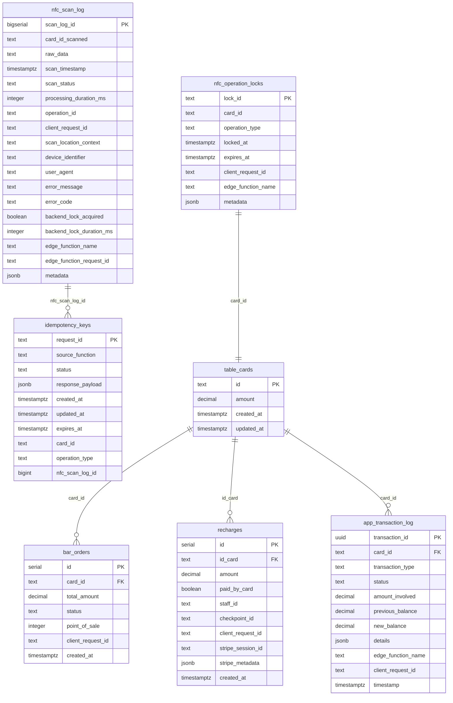

# Phase 3 Database Schema Documentation

## Overview

Phase 3 introduces comprehensive database-level debouncing and enhanced NFC logging capabilities. This document provides complete specifications for all Phase 3 database components including tables, indexes, functions, and performance considerations.

## 📊 Database Architecture Overview



## 🗄️ Table Specifications

### `nfc_scan_log` - Enhanced NFC Scan Logging

Comprehensive tracking of all NFC scan events with detailed metadata and performance metrics.

```sql
CREATE TABLE nfc_scan_log (
    scan_log_id BIGSERIAL PRIMARY KEY,
    
    -- Core scan data
    card_id_scanned TEXT,
    raw_data TEXT,
    scan_timestamp TIMESTAMPTZ DEFAULT NOW(),
    
    -- Enhanced scan status tracking
    scan_status TEXT NOT NULL CHECK (scan_status IN (
        'success', 'failure', 'duplicate', 'invalid_format', 
        'backend_rejected', 'processing_error', 'timeout'
    )),
    
    -- Processing information
    processing_duration_ms INTEGER,
    operation_id TEXT,
    client_request_id TEXT,
    
    -- Context information
    scan_location_context TEXT,
    device_identifier TEXT,
    user_agent TEXT,
    
    -- Error tracking
    error_message TEXT,
    error_code TEXT,
    
    -- Backend coordination
    backend_lock_acquired BOOLEAN DEFAULT FALSE,
    backend_lock_duration_ms INTEGER,
    
    -- Request tracing
    edge_function_name TEXT,
    edge_function_request_id TEXT,
    
    -- Additional metadata
    metadata JSONB DEFAULT '{}'::jsonb
);
```

#### Field Specifications

| Field | Type | Nullable | Description | Example |
|-------|------|----------|-------------|---------|
| `scan_log_id` | BIGSERIAL | NO | Primary key, auto-incrementing | `1001` |
| `card_id_scanned` | TEXT | YES | The card ID that was scanned | `"ABC12345"` |
| `raw_data` | TEXT | YES | Raw NFC data if available | `"ndef:text:ABC12345"` |
| `scan_timestamp` | TIMESTAMPTZ | NO | When the scan occurred | `2025-06-14 14:30:15+02` |
| `scan_status` | TEXT | NO | Status of the scan operation | `"success"` |
| `processing_duration_ms` | INTEGER | YES | Time taken to process (milliseconds) | `250` |
| `operation_id` | TEXT | YES | Unique operation identifier | `"nfc_op_1718374215_abc123"` |
| `client_request_id` | TEXT | YES | Client-generated request ID | `"req_bar_1718374215"` |
| `scan_location_context` | TEXT | YES | Where the scan occurred | `"/bar"` |
| `device_identifier` | TEXT | YES | Device/browser identifier | `"Mozilla/5.0 (Android..."` |
| `user_agent` | TEXT | YES | Full user agent string | `"Mozilla/5.0..."` |
| `error_message` | TEXT | YES | Human-readable error message | `"Insufficient funds"` |
| `error_code` | TEXT | YES | Machine-readable error code | `"INSUFFICIENT_FUNDS"` |
| `backend_lock_acquired` | BOOLEAN | NO | Whether backend lock was acquired | `true` |
| `backend_lock_duration_ms` | INTEGER | YES | Duration lock was held | `150` |
| `edge_function_name` | TEXT | YES | Which edge function processed | `"process-bar-order"` |
| `edge_function_request_id` | TEXT | YES | Edge function request ID | `"req_123abc"` |
| `metadata` | JSONB | NO | Additional structured data | `{"total_amount": 15.50}` |

#### Scan Status Values

| Status | Description | When Used |
|--------|-------------|-----------|
| `success` | Scan and processing completed successfully | Normal operation completion |
| `failure` | Scan failed due to technical issues | NFC read errors, device issues |
| `duplicate` | Duplicate scan detected and prevented | Within debounce window |
| `invalid_format` | Card ID format validation failed | Invalid card ID pattern |
| `backend_rejected` | Backend coordination rejected operation | Concurrent operation detected |
| `processing_error` | Error during business logic processing | Insufficient funds, etc. |
| `timeout` | Operation exceeded time limits | Long-running operations |

### `nfc_operation_locks` - Operation Coordination

Short-lived locks to prevent concurrent NFC operations on the same card.

```sql
CREATE TABLE nfc_operation_locks (
    lock_id TEXT PRIMARY KEY,
    card_id TEXT NOT NULL,
    operation_type TEXT NOT NULL CHECK (operation_type IN (
        'bar_order', 'stripe_recharge', 'checkpoint_recharge', 'balance_check'
    )),
    locked_at TIMESTAMPTZ DEFAULT NOW(),
    expires_at TIMESTAMPTZ DEFAULT NOW() + INTERVAL '30 seconds',
    client_request_id TEXT,
    edge_function_name TEXT,
    metadata JSONB DEFAULT '{}'::jsonb
);
```

#### Field Specifications

| Field | Type | Nullable | Description | Example |
|-------|------|----------|-------------|---------|
| `lock_id` | TEXT | NO | Unique lock identifier | `"nfc_lock_ABC12345_bar_order_1718374215_123"` |
| `card_id` | TEXT | NO | Card being locked | `"ABC12345"` |
| `operation_type` | TEXT | NO | Type of operation | `"bar_order"` |
| `locked_at` | TIMESTAMPTZ | NO | When lock was acquired | `2025-06-14 14:30:15+02` |
| `expires_at` | TIMESTAMPTZ | NO | When lock expires | `2025-06-14 14:30:45+02` |
| `client_request_id` | TEXT | YES | Associated request ID | `"req_bar_1718374215"` |
| `edge_function_name` | TEXT | YES | Function that acquired lock | `"process-bar-order"` |
| `metadata` | JSONB | NO | Additional lock metadata | `{"priority": "high"}` |

#### Operation Types

| Type | Description | Typical Duration |
|------|-------------|------------------|
| `bar_order` | Bar payment processing | 5-15 seconds |
| `stripe_recharge` | Stripe payment processing | 10-30 seconds |
| `checkpoint_recharge` | Manual recharge processing | 5-10 seconds |
| `balance_check` | Balance inquiry | 1-3 seconds |

### Enhanced `idempotency_keys` Table

Extended with NFC-specific columns for comprehensive request tracking.

#### New Columns Added

```sql
-- Add NFC-specific columns to existing idempotency_keys table
ALTER TABLE idempotency_keys ADD COLUMN card_id TEXT;
ALTER TABLE idempotency_keys ADD COLUMN operation_type TEXT;
ALTER TABLE idempotency_keys ADD COLUMN nfc_scan_log_id BIGINT;
```

#### Complete Schema

| Field | Type | Nullable | Description |
|-------|------|----------|-------------|
| `request_id` | TEXT | NO | Primary key, unique request identifier |
| `source_function` | TEXT | NO | Function that created the key |
| `status` | TEXT | NO | Processing status |
| `response_payload` | JSONB | YES | Cached response data |
| `created_at` | TIMESTAMPTZ | NO | When key was created |
| `updated_at` | TIMESTAMPTZ | NO | Last update timestamp |
| `expires_at` | TIMESTAMPTZ | NO | When key expires |
| `card_id` | TEXT | YES | **NEW**: Associated card ID |
| `operation_type` | TEXT | YES | **NEW**: Type of operation |
| `nfc_scan_log_id` | BIGINT | YES | **NEW**: Reference to scan log |

## 🔍 Indexes and Performance

### Primary Indexes

```sql
-- NFC scan log indexes
CREATE INDEX idx_nfc_scan_log_timestamp ON nfc_scan_log(scan_timestamp);
CREATE INDEX idx_nfc_scan_log_card_id ON nfc_scan_log(card_id_scanned);
CREATE INDEX idx_nfc_scan_log_status ON nfc_scan_log(scan_status);
CREATE INDEX idx_nfc_scan_log_operation_id ON nfc_scan_log(operation_id);
CREATE INDEX idx_nfc_scan_log_client_request_id ON nfc_scan_log(client_request_id);

-- NFC operation locks indexes
CREATE INDEX idx_nfc_operation_locks_card_id ON nfc_operation_locks(card_id);
CREATE INDEX idx_nfc_operation_locks_expires_at ON nfc_operation_locks(expires_at);
CREATE INDEX idx_nfc_operation_locks_operation_type ON nfc_operation_locks(operation_type);

-- Enhanced idempotency keys indexes
CREATE INDEX idx_idempotency_keys_card_id ON idempotency_keys(card_id);
CREATE INDEX idx_idempotency_keys_operation_type ON idempotency_keys(operation_type);
```

### Composite Indexes

```sql
-- Composite indexes for common query patterns
CREATE INDEX idx_nfc_scan_log_card_status_time 
ON nfc_scan_log(card_id_scanned, scan_status, scan_timestamp);

CREATE INDEX idx_nfc_operation_locks_card_type_expires 
ON nfc_operation_locks(card_id, operation_type, expires_at);

CREATE INDEX idx_nfc_scan_log_edge_function_time 
ON nfc_scan_log(edge_function_name, scan_timestamp);
```

### Performance Considerations

#### Query Optimization

**Efficient Scan Log Queries:**
```sql
-- Use timestamp index for recent scans
SELECT * FROM nfc_scan_log 
WHERE scan_timestamp > NOW() - INTERVAL '1 hour'
ORDER BY scan_timestamp DESC;

-- Use composite index for card-specific queries
SELECT * FROM nfc_scan_log 
WHERE card_id_scanned = 'ABC12345' 
  AND scan_status = 'success'
ORDER BY scan_timestamp DESC;
```

**Lock Table Optimization:**
```sql
-- Efficient lock cleanup using expires_at index
DELETE FROM nfc_operation_locks 
WHERE expires_at < NOW();

-- Fast lock checking using composite index
SELECT * FROM nfc_operation_locks 
WHERE card_id = 'ABC12345' 
  AND operation_type = 'bar_order' 
  AND expires_at > NOW();
```

#### Storage Considerations

| Table | Estimated Size per Row | Daily Volume | Monthly Storage |
|-------|----------------------|--------------|-----------------|
| `nfc_scan_log` | ~1KB | 10,000 scans | ~300MB |
| `nfc_operation_locks` | ~200B | 10,000 locks | ~60MB (with cleanup) |
| `idempotency_keys` | ~500B | 5,000 keys | ~75MB |

## 🔧 Database Functions

### Lock Management Functions

#### `acquire_nfc_operation_lock()`

Acquires a short-lived lock for NFC operations with automatic cleanup.

```sql
CREATE OR REPLACE FUNCTION acquire_nfc_operation_lock(
    card_id_in TEXT,
    operation_type_in TEXT,
    client_request_id_in TEXT,
    edge_function_name_in TEXT DEFAULT NULL,
    lock_duration_seconds INTEGER DEFAULT 30
) RETURNS JSONB
```

**Parameters:**
- `card_id_in`: Card ID to lock
- `operation_type_in`: Type of operation (`bar_order`, `stripe_recharge`, etc.)
- `client_request_id_in`: Client request identifier
- `edge_function_name_in`: Name of the calling edge function
- `lock_duration_seconds`: Lock duration (default: 30 seconds)

**Returns:**
```json
{
  "success": true,
  "lock_acquired": true,
  "lock_id": "nfc_lock_ABC12345_bar_order_1718374215_123",
  "expires_at": "2025-06-14T14:30:45+02:00"
}
```

**Usage Example:**
```sql
SELECT acquire_nfc_operation_lock(
    'ABC12345', 
    'bar_order', 
    'req_bar_1718374215', 
    'process-bar-order',
    30
);
```

#### `release_nfc_operation_lock()`

Releases an NFC operation lock.

```sql
CREATE OR REPLACE FUNCTION release_nfc_operation_lock(
    lock_id_in TEXT
) RETURNS JSONB
```

**Parameters:**
- `lock_id_in`: Lock ID to release

**Returns:**
```json
{
  "success": true,
  "lock_released": true,
  "lock_id": "nfc_lock_ABC12345_bar_order_1718374215_123"
}
```

#### `check_nfc_operation_lock()`

Checks if an NFC operation lock exists for a card and operation type.

```sql
CREATE OR REPLACE FUNCTION check_nfc_operation_lock(
    card_id_in TEXT,
    operation_type_in TEXT
) RETURNS JSONB
```

**Returns:**
```json
{
  "lock_exists": true,
  "lock_id": "nfc_lock_ABC12345_bar_order_1718374215_123",
  "locked_at": "2025-06-14T14:30:15+02:00",
  "expires_at": "2025-06-14T14:30:45+02:00",
  "client_request_id": "req_bar_1718374215"
}
```

### Enhanced Stored Procedures

#### `sp_process_bar_order_with_debouncing()`

Enhanced bar order processing with comprehensive NFC debouncing.

```sql
CREATE OR REPLACE FUNCTION sp_process_bar_order_with_debouncing(
    card_id_in TEXT,
    items_in JSONB,
    total_amount_in DECIMAL,
    client_request_id_in TEXT,
    point_of_sale_in INT DEFAULT 1,
    nfc_scan_log_id_in BIGINT DEFAULT NULL
) RETURNS JSONB
```

**Key Features:**
- Automatic NFC operation lock acquisition
- Comprehensive error handling with scan log updates
- Performance tracking and monitoring
- Idempotency protection with NFC integration

**Processing Flow:**
1. Acquire NFC operation lock
2. Check idempotency key
3. Validate card and balance
4. Process order atomically
5. Update scan log with results
6. Release lock

#### `sp_process_checkpoint_recharge_with_debouncing()`

Enhanced checkpoint recharge processing with NFC debouncing.

```sql
CREATE OR REPLACE FUNCTION sp_process_checkpoint_recharge_with_debouncing(
    card_id_in TEXT,
    amount_in DECIMAL,
    payment_method_in TEXT,
    staff_id_in TEXT,
    client_request_id_in TEXT,
    checkpoint_id_in TEXT,
    nfc_scan_log_id_in BIGINT DEFAULT NULL
) RETURNS JSONB
```

#### `sp_process_stripe_recharge_with_debouncing()`

Enhanced Stripe recharge processing with NFC debouncing.

```sql
CREATE OR REPLACE FUNCTION sp_process_stripe_recharge_with_debouncing(
    card_id_in TEXT,
    amount_in DECIMAL,
    stripe_session_id_in TEXT,
    stripe_metadata_in JSONB,
    nfc_scan_log_id_in BIGINT DEFAULT NULL
) RETURNS JSONB
```

### Maintenance Functions

#### `cleanup_expired_nfc_resources()`

Comprehensive cleanup of expired NFC resources.

```sql
CREATE OR REPLACE FUNCTION cleanup_expired_nfc_resources() RETURNS JSONB
```

**Cleanup Operations:**
- Remove expired NFC operation locks
- Clean up expired idempotency keys
- Archive old NFC scan logs (30+ days)

**Returns:**
```json
{
  "deleted_locks": 15,
  "deleted_idempotency_keys": 8,
  "deleted_scan_logs": 1250,
  "cleanup_timestamp": "2025-06-14T14:30:15+02:00"
}
```

**Recommended Schedule:**
```sql
-- Run every 5 minutes via cron or scheduled job
SELECT cleanup_expired_nfc_resources();
```

## 📊 Query Patterns and Examples

### Common Monitoring Queries

#### Recent NFC Activity
```sql
-- Recent scan activity by status
SELECT 
    scan_status,
    COUNT(*) as count,
    AVG(processing_duration_ms) as avg_duration_ms
FROM nfc_scan_log 
WHERE scan_timestamp > NOW() - INTERVAL '1 hour'
GROUP BY scan_status
ORDER BY count DESC;
```

#### Performance Analysis
```sql
-- Processing performance by edge function
SELECT 
    edge_function_name,
    COUNT(*) as total_operations,
    AVG(processing_duration_ms) as avg_duration_ms,
    MAX(processing_duration_ms) as max_duration_ms,
    PERCENTILE_CONT(0.95) WITHIN GROUP (ORDER BY processing_duration_ms) as p95_duration_ms
FROM nfc_scan_log 
WHERE scan_timestamp > NOW() - INTERVAL '24 hours'
  AND processing_duration_ms IS NOT NULL
GROUP BY edge_function_name
ORDER BY avg_duration_ms DESC;
```

#### Error Analysis
```sql
-- Error patterns and frequencies
SELECT 
    scan_status,
    error_code,
    COUNT(*) as error_count,
    array_agg(DISTINCT error_message) as error_messages
FROM nfc_scan_log 
WHERE scan_status IN ('failure', 'processing_error', 'backend_rejected')
  AND scan_timestamp > NOW() - INTERVAL '24 hours'
GROUP BY scan_status, error_code
ORDER BY error_count DESC;
```

#### Lock Monitoring
```sql
-- Current active locks
SELECT 
    card_id,
    operation_type,
    locked_at,
    expires_at,
    EXTRACT(EPOCH FROM (expires_at - NOW())) as seconds_remaining
FROM nfc_operation_locks 
WHERE expires_at > NOW()
ORDER BY locked_at;

-- Lock usage patterns
SELECT 
    operation_type,
    COUNT(*) as total_locks,
    AVG(EXTRACT(EPOCH FROM (expires_at - locked_at))) as avg_duration_seconds
FROM nfc_operation_locks 
WHERE locked_at > NOW() - INTERVAL '24 hours'
GROUP BY operation_type;
```

### Troubleshooting Queries

#### Duplicate Detection Analysis
```sql
-- Cards with multiple scans in short timeframe
SELECT 
    card_id_scanned,
    COUNT(*) as scan_count,
    array_agg(scan_status ORDER BY scan_timestamp) as statuses,
    MAX(scan_timestamp) - MIN(scan_timestamp) as time_span
FROM nfc_scan_log 
WHERE scan_timestamp > NOW() - INTERVAL '1 hour'
GROUP BY card_id_scanned
HAVING COUNT(*) > 1
ORDER BY scan_count DESC;
```

#### Stuck Lock Detection
```sql
-- Locks that should have expired
SELECT 
    lock_id,
    card_id,
    operation_type,
    locked_at,
    expires_at,
    EXTRACT(EPOCH FROM (NOW() - expires_at)) as expired_seconds_ago
FROM nfc_operation_locks 
WHERE expires_at < NOW()
ORDER BY expired_seconds_ago DESC;
```

#### Performance Bottlenecks
```sql
-- Slowest operations by card
SELECT 
    card_id_scanned,
    edge_function_name,
    MAX(processing_duration_ms) as max_duration_ms,
    AVG(processing_duration_ms) as avg_duration_ms,
    COUNT(*) as operation_count
FROM nfc_scan_log 
WHERE processing_duration_ms > 1000  -- Operations taking > 1 second
  AND scan_timestamp > NOW() - INTERVAL '24 hours'
GROUP BY card_id_scanned, edge_function_name
ORDER BY max_duration_ms DESC;
```

## 🔒 Security Considerations

### Data Privacy

#### Sensitive Data Handling
- **Card IDs**: Stored as-is for operational needs, consider hashing for long-term storage
- **User Agent**: Truncated to 100 characters to prevent excessive data collection
- **Device Identifier**: Limited to essential debugging information
- **Raw Data**: NFC raw data stored only when necessary for debugging

#### Data Retention
```sql
-- Automatic cleanup of old scan logs (30 days)
DELETE FROM nfc_scan_log 
WHERE scan_timestamp < NOW() - INTERVAL '30 days';

-- Archive sensitive data before deletion
INSERT INTO nfc_scan_log_archive 
SELECT * FROM nfc_scan_log 
WHERE scan_timestamp < NOW() - INTERVAL '30 days';
```

### Access Control

#### Function Security
- All stored procedures use `SECURITY DEFINER` where appropriate
- Lock functions include proper validation and cleanup
- Error messages sanitized to prevent information leakage

#### Row-Level Security (RLS)
```sql
-- Enable RLS on sensitive tables
ALTER TABLE nfc_scan_log ENABLE ROW LEVEL SECURITY;

-- Policy for application access
CREATE POLICY nfc_scan_log_app_access ON nfc_scan_log
    FOR ALL TO application_role
    USING (scan_timestamp > NOW() - INTERVAL '7 days');
```

## 🚀 Migration and Deployment

### Migration Script Structure

The Phase 3 migration ([`20250609_phase3_debouncing.sql`](../supabase/migrations/20250609_phase3_debouncing.sql:1)) includes:

1. **Table Creation**: New tables with proper constraints
2. **Index Creation**: Performance-optimized indexes
3. **Function Deployment**: Lock management and enhanced stored procedures
4. **Data Migration**: Existing data compatibility
5. **Cleanup Setup**: Automated maintenance functions

### Deployment Verification

```sql
-- Verify new tables exist
SELECT table_name, table_type 
FROM information_schema.tables 
WHERE table_name IN ('nfc_scan_log', 'nfc_operation_locks')
  AND table_schema = 'public';

-- Test lock functions
SELECT acquire_nfc_operation_lock('TEST123', 'bar_order', 'test_request');
SELECT check_nfc_operation_lock('TEST123', 'bar_order');
SELECT release_nfc_operation_lock('nfc_lock_TEST123_bar_order_*');

-- Verify indexes
SELECT indexname, tablename 
FROM pg_indexes 
WHERE tablename LIKE 'nfc_%' 
  AND schemaname = 'public';
```

### Rollback Procedures

```sql
-- Emergency rollback (if needed)
DROP TABLE IF EXISTS nfc_operation_locks CASCADE;
DROP TABLE IF EXISTS nfc_scan_log CASCADE;

-- Remove added columns from idempotency_keys
ALTER TABLE idempotency_keys DROP COLUMN IF EXISTS card_id;
ALTER TABLE idempotency_keys DROP COLUMN IF EXISTS operation_type;
ALTER TABLE idempotency_keys DROP COLUMN IF EXISTS nfc_scan_log_id;

-- Drop functions
DROP FUNCTION IF EXISTS acquire_nfc_operation_lock CASCADE;
DROP FUNCTION IF EXISTS release_nfc_operation_lock CASCADE;
DROP FUNCTION IF EXISTS check_nfc_operation_lock CASCADE;
DROP FUNCTION IF EXISTS cleanup_expired_nfc_resources CASCADE;
```

## 📈 Performance Tuning

### Database Configuration

#### Recommended Settings
```sql
-- Optimize for frequent small transactions
SET shared_preload_libraries = 'pg_stat_statements';
SET track_activity_query_size = 2048;
SET log_min_duration_statement = 1000;  -- Log slow queries

-- Connection pooling optimization
SET max_connections = 200;
SET shared_buffers = '256MB';
SET effective_cache_size = '1GB';
```

#### Monitoring Queries
```sql
-- Monitor table sizes
SELECT 
    schemaname,
    tablename,
    pg_size_pretty(pg_total_relation_size(schemaname||'.'||tablename)) as size,
    pg_total_relation_size(schemaname||'.'||tablename) as size_bytes
FROM pg_tables 
WHERE tablename LIKE 'nfc_%'
ORDER BY size_bytes DESC;

-- Index usage statistics
SELECT 
    schemaname,
    tablename,
    indexname,
    idx_scan,
    idx_tup_read,
    idx_tup_fetch
FROM pg_stat_user_indexes 
WHERE tablename LIKE 'nfc_%'
ORDER BY idx_scan DESC;
```

### Optimization Strategies

#### Partitioning (Future Enhancement)
```sql
-- Consider partitioning nfc_scan_log by timestamp for large volumes
CREATE TABLE nfc_scan_log_y2025m06 PARTITION OF nfc_scan_log
    FOR VALUES FROM ('2025-06-01') TO ('2025-07-01');
```

#### Archival Strategy
```sql
-- Archive old data to separate tables
CREATE TABLE nfc_scan_log_archive (LIKE nfc_scan_log INCLUDING ALL);

-- Automated archival function
CREATE OR REPLACE FUNCTION archive_old_nfc_logs() RETURNS INTEGER AS $$
DECLARE
    archived_count INTEGER;
BEGIN
    WITH archived AS (
        DELETE FROM nfc_scan_log 
        WHERE scan_timestamp < NOW() - INTERVAL '30 days'
        RETURNING *
    )
    INSERT INTO nfc_scan_log_archive SELECT * FROM archived;
    
    GET DIAGNOSTICS archived_count = ROW_COUNT;
    RETURN archived_count;
END;
$$ LANGUAGE plpgsql;
```

## 📚 Related Documentation

- **[`PHASE3_NFC_STATE_MACHINE.md`](PHASE3_NFC_STATE_MACHINE.md:1)**: NFC state machine implementation
- **[`PHASE3_API_REFERENCE.md`](PHASE3_API_REFERENCE.md:1)**: API specifications and integration
- **[`PHASE3_MONITORING_GUIDE.md`](PHASE3_MONITORING_GUIDE.md:1)**: Operational monitoring and alerting
- **[`../supabase/migrations/20250609_phase3_debouncing.sql`](../supabase/migrations/20250609_phase3_debouncing.sql:1)**: Complete migration script
- **[`PHASE3_IMPLEMENTATION_SUMMARY.md`](PHASE3_IMPLEMENTATION_SUMMARY.md:1)**: High-level implementation overview