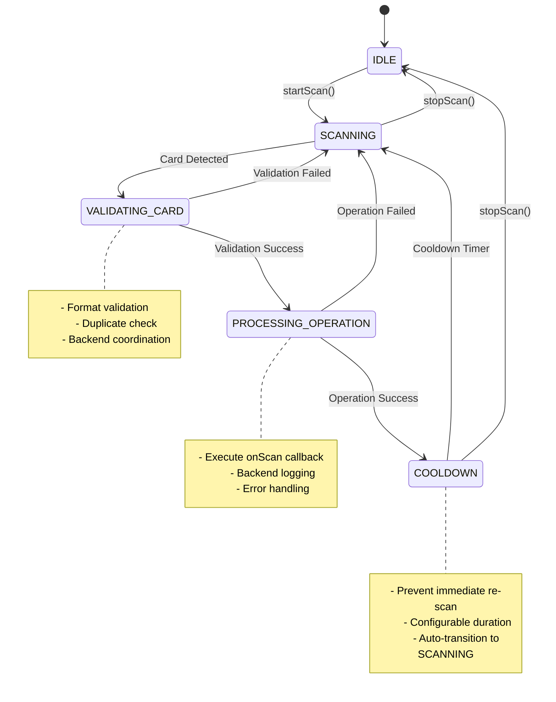

# Phase 3 NFC State Machine Documentation

## Overview

The Phase 3 NFC system implements a comprehensive 5-state machine in the [`use-nfc.tsx`](../src/hooks/use-nfc.tsx:1) hook that provides robust handling of NFC operations with comprehensive debouncing, error recovery, and backend coordination.

## 🔄 State Machine Architecture

### State Definitions

```typescript
type NFCState = 'IDLE' | 'SCANNING' | 'VALIDATING_CARD' | 'PROCESSING_OPERATION' | 'COOLDOWN';
```

#### State Descriptions

| State | Description | Duration | Next States |
|-------|-------------|----------|-------------|
| **IDLE** | Ready to start scanning, no active operations | Indefinite | SCANNING |
| **SCANNING** | Actively scanning for NFC cards | Until card detected | VALIDATING_CARD, IDLE |
| **VALIDATING_CARD** | Card detected, validating format and duplicates | ~100-500ms | PROCESSING_OPERATION, SCANNING |
| **PROCESSING_OPERATION** | Valid card confirmed, executing business operation | Variable | COOLDOWN, SCANNING |
| **COOLDOWN** | Operation completed, preventing duplicate scans | 3000ms (configurable) | SCANNING, IDLE |

## 🔀 State Transition Diagram



## 🛠️ State Machine Implementation

### Core State Management

```typescript
// State machine state
const [state, setState] = useState<NFCState>('IDLE');

// State transition with logging
const transitionToState = useCallback((newState: NFCState, reason?: string) => {
  const previousState = state;
  setState(newState);
  
  logger.nfc('State transition', {
    from: previousState,
    to: newState,
    reason: reason || 'No reason provided',
    timestamp: Date.now()
  });
}, [state]);
```

### State-Specific Behaviors

#### IDLE State
- **Entry**: System ready, all resources cleaned up
- **Actions**: None
- **Exit Conditions**: User calls `startScan()`
- **Cleanup**: Comprehensive resource cleanup performed

#### SCANNING State
- **Entry**: NFC reader initialized and scanning
- **Actions**: 
  - Continuous NFC card monitoring
  - Periodic cleanup of expired scan records
  - Event listener management
- **Exit Conditions**: 
  - Card detected → VALIDATING_CARD
  - User calls `stopScan()` → IDLE
  - Error occurs → IDLE

#### VALIDATING_CARD State
- **Entry**: NFC card detected, beginning validation
- **Actions**:
  - Card ID format validation
  - Duplicate scan detection
  - Backend coordination check
- **Exit Conditions**:
  - Validation success → PROCESSING_OPERATION
  - Validation failure → SCANNING
  - Error → SCANNING

#### PROCESSING_OPERATION State
- **Entry**: Valid card confirmed, executing operation
- **Actions**:
  - Execute `onScan` callback
  - Update scan history
  - Backend logging
  - Performance tracking
- **Exit Conditions**:
  - Operation success → COOLDOWN
  - Operation failure → SCANNING

#### COOLDOWN State
- **Entry**: Operation completed, preventing duplicates
- **Actions**:
  - Timer management
  - Duplicate prevention
- **Exit Conditions**:
  - Timer expires → SCANNING
  - User calls `stopScan()` → IDLE

## 🔧 Configuration Options

### Hook Configuration

```typescript
interface UseNfcOptions {
  /** Callback triggered when a valid card is scanned */
  onScan?: (id: string) => void;
  
  /** Function to validate scanned card IDs */
  validateId?: (id: string) => boolean;
  
  /** Function to get current transaction amount for logging */
  getTotalAmount?: () => number;
  
  /** Debounce time in milliseconds (default: 2000) */
  debounceTime?: number;
  
  /** Cooldown time in milliseconds (default: 3000) */
  cooldownTime?: number;
  
  /** Maximum duplicate scan window in milliseconds (default: 5000) */
  duplicateWindow?: number;
  
  /** Enable backend coordination for duplicate prevention */
  enableBackendCoordination?: boolean;
}
```

### Default Configuration

```typescript
const defaultConfig = {
  debounceTime: 2000,        // 2 seconds
  cooldownTime: 3000,        // 3 seconds
  duplicateWindow: 5000,     // 5 seconds
  enableBackendCoordination: true
};
```

## 🚨 Error Handling and Recovery

### Error Categories

#### Validation Errors
- **Invalid Format**: Card ID doesn't match expected pattern
- **Duplicate Scan**: Card scanned within duplicate window
- **Backend Rejection**: Backend coordination failed

#### Processing Errors
- **Operation Failure**: Business logic execution failed
- **Timeout**: Operation exceeded time limits
- **Network Error**: Backend communication failed

### Recovery Mechanisms

#### Automatic Recovery
```typescript
// State machine automatically recovers from errors
catch (error) {
  logger.error('Error processing scanned card', error, { cardId, source });
  setError('Erreur lors du traitement de la carte');
  transitionToState('SCANNING', 'Error during card processing');
}
```

#### Manual Recovery
```typescript
// Reset function for manual recovery
const reset = useCallback(() => {
  logger.nfc('Resetting NFC hook');
  performComprehensiveCleanup();
  setLastScannedId(null);
  setError(null);
  cardScanHistory.current.clear();
}, [performComprehensiveCleanup]);
```

## 📊 Duplicate Prevention System

### Card Scan History Tracking

```typescript
interface CardScanRecord {
  cardId: string;
  timestamp: number;
  operationId: string;
  processed: boolean;
}

// In-memory tracking
const cardScanHistory = useRef<Map<string, CardScanRecord>>(new Map());
```

### Duplicate Detection Logic

```typescript
const isDuplicateScan = useCallback((cardId: string): boolean => {
  const now = Date.now();
  const existingRecord = cardScanHistory.current.get(cardId);
  
  if (!existingRecord) {
    return false;
  }
  
  const timeDiff = now - existingRecord.timestamp;
  const isDuplicate = timeDiff < duplicateWindow;
  
  logger.nfc('Duplicate scan check', {
    cardId,
    timeDiff,
    duplicateWindow,
    isDuplicate
  });
  
  return isDuplicate;
}, [duplicateWindow]);
```

### Backend Coordination

```typescript
const checkBackendCoordination = useCallback(async (
  cardId: string, 
  operationId: string
): Promise<boolean> => {
  if (!enableBackendCoordination) {
    return true;
  }

  try {
    // Send NFC scan log to backend for coordination
    const response = await fetch('/functions/v1/log', {
      method: 'POST',
      headers: { 'Content-Type': 'application/json' },
      body: JSON.stringify({
        nfc_scans: [{
          card_id_scanned: cardId,
          scan_status: 'success',
          operation_id: operationId,
          scan_location_context: window.location.pathname,
          device_identifier: navigator.userAgent.substring(0, 100),
          metadata: {
            total_amount: getTotalAmount?.(),
            timestamp: new Date().toISOString()
          }
        }]
      })
    });

    return response.ok;
  } catch (error) {
    logger.error('Backend coordination failed', error);
    return true; // Don't fail operation due to coordination issues
  }
}, [enableBackendCoordination, getTotalAmount]);
```

## 🔍 Monitoring and Debugging

### State Monitoring

```typescript
// Hook return values for monitoring
return {
  // State information
  state,
  isScanning,
  isSupported,
  lastScannedId,
  error,
  
  // State checks for UI
  isIdle: state === 'IDLE',
  isValidating: state === 'VALIDATING_CARD',
  isProcessing: state === 'PROCESSING_OPERATION',
  isInCooldown: state === 'COOLDOWN',
  
  // Utility functions for debugging
  getScanHistory: () => Array.from(cardScanHistory.current.entries()),
  getCurrentOperationId: () => currentOperationId.current
};
```

### Debug Logging

```typescript
// Comprehensive logging throughout state machine
logger.nfc('State transition', {
  from: previousState,
  to: newState,
  reason,
  timestamp: Date.now()
});

logger.nfc('Processing scanned card', {
  cardId,
  source,
  currentState: state
});

logger.nfc('Backend coordination completed', {
  cardId,
  operationId,
  result
});
```

## 🎯 Integration Patterns

### Basic Usage

```typescript
const { 
  state, 
  isScanning, 
  startScan, 
  stopScan, 
  lastScannedId,
  error 
} = useNfc({
  onScan: (cardId) => {
    console.log('Card scanned:', cardId);
    processPayment(cardId);
  },
  validateId: (id) => id.length === 8,
  getTotalAmount: () => orderTotal
});
```

### Advanced Usage with Custom Configuration

```typescript
const nfcHook = useNfc({
  onScan: handleCardScan,
  validateId: validateCardFormat,
  getTotalAmount: () => currentOrder.total,
  debounceTime: 1500,        // Faster debouncing
  cooldownTime: 2000,        // Shorter cooldown
  duplicateWindow: 3000,     // Tighter duplicate window
  enableBackendCoordination: true
});

// Monitor state changes
useEffect(() => {
  console.log('NFC State changed:', nfcHook.state);
  
  if (nfcHook.error) {
    showErrorToast(nfcHook.error);
  }
}, [nfcHook.state, nfcHook.error]);
```

### UI Integration

```typescript
const NFCStatusIndicator = () => {
  const { state, isScanning, error } = useNfc();
  
  return (
    <div className="nfc-status">
      {state === 'IDLE' && <span>Ready to scan</span>}
      {state === 'SCANNING' && <span>Scanning for cards...</span>}
      {state === 'VALIDATING_CARD' && <span>Validating card...</span>}
      {state === 'PROCESSING_OPERATION' && <span>Processing...</span>}
      {state === 'COOLDOWN' && <span>Please wait...</span>}
      {error && <span className="error">{error}</span>}
    </div>
  );
};
```

## 🧪 Testing Strategies

### Unit Testing State Transitions

```typescript
describe('NFC State Machine', () => {
  it('should transition from IDLE to SCANNING when startScan is called', async () => {
    const { result } = renderHook(() => useNfc());
    
    expect(result.current.state).toBe('IDLE');
    
    await act(async () => {
      await result.current.startScan();
    });
    
    expect(result.current.state).toBe('SCANNING');
  });
  
  it('should handle duplicate scans correctly', async () => {
    const onScan = vi.fn();
    const { result } = renderHook(() => useNfc({ onScan }));
    
    // First scan
    await act(async () => {
      await simulateCardScan('12345678');
    });
    
    expect(onScan).toHaveBeenCalledTimes(1);
    
    // Duplicate scan within window
    await act(async () => {
      await simulateCardScan('12345678');
    });
    
    expect(onScan).toHaveBeenCalledTimes(1); // Should not be called again
  });
});
```

### Integration Testing

```typescript
describe('NFC Integration', () => {
  it('should coordinate with backend for duplicate prevention', async () => {
    const mockFetch = vi.fn().mockResolvedValue({ ok: true });
    global.fetch = mockFetch;
    
    const { result } = renderHook(() => useNfc({
      enableBackendCoordination: true
    }));
    
    await act(async () => {
      await simulateCardScan('12345678');
    });
    
    expect(mockFetch).toHaveBeenCalledWith('/functions/v1/log', {
      method: 'POST',
      headers: { 'Content-Type': 'application/json' },
      body: expect.stringContaining('12345678')
    });
  });
});
```

## 🚀 Performance Considerations

### Memory Management

- **Automatic Cleanup**: Expired scan records are automatically cleaned up every 30 seconds
- **Resource Management**: Comprehensive cleanup on unmount and state transitions
- **Timer Management**: All timers are properly cleared to prevent memory leaks

### Performance Optimizations

- **Debounced Operations**: Prevents excessive processing of rapid scans
- **Efficient State Checks**: Memoized state derivations for UI components
- **Minimal Re-renders**: Optimized hook dependencies to reduce unnecessary renders

### Scalability

- **Configurable Windows**: Adjustable debounce and cooldown times for different use cases
- **Backend Coordination**: Offloads duplicate prevention to backend for multi-device scenarios
- **Efficient Logging**: Batch processing and optimized data structures

## 🔧 Troubleshooting Guide

### Common Issues

#### State Machine Stuck in SCANNING
**Symptoms**: Hook remains in SCANNING state indefinitely
**Causes**: NFC reader initialization failed, browser compatibility issues
**Solutions**:
```typescript
// Manual reset
nfcHook.reset();

// Check browser support
if (!nfcHook.isSupported) {
  console.error('NFC not supported in this browser');
}
```

#### Duplicate Scans Not Prevented
**Symptoms**: Same card processed multiple times rapidly
**Causes**: Backend coordination disabled, duplicate window too short
**Solutions**:
```typescript
// Enable backend coordination
const nfcHook = useNfc({
  enableBackendCoordination: true,
  duplicateWindow: 5000 // Increase window
});
```

#### High Memory Usage
**Symptoms**: Memory usage increases over time
**Causes**: Scan history not being cleaned up
**Solutions**:
```typescript
// Manual cleanup
useEffect(() => {
  const interval = setInterval(() => {
    // Cleanup is automatic, but can be monitored
    const historySize = nfcHook.getScanHistory().length;
    console.log('Scan history size:', historySize);
  }, 60000);
  
  return () => clearInterval(interval);
}, []);
```

### Debug Information

```typescript
// Get comprehensive debug information
const debugInfo = {
  state: nfcHook.state,
  isSupported: nfcHook.isSupported,
  scanHistory: nfcHook.getScanHistory(),
  currentOperationId: nfcHook.getCurrentOperationId(),
  lastScannedId: nfcHook.lastScannedId,
  error: nfcHook.error
};

console.log('NFC Debug Info:', debugInfo);
```

## 📚 Related Documentation

- **[`PHASE3_DATABASE_SCHEMA.md`](PHASE3_DATABASE_SCHEMA.md:1)**: Database schema for NFC logging
- **[`PHASE3_API_REFERENCE.md`](PHASE3_API_REFERENCE.md:1)**: Backend API integration
- **[`PHASE3_MONITORING_GUIDE.md`](PHASE3_MONITORING_GUIDE.md:1)**: Operational monitoring
- **[`../src/hooks/use-nfc.tsx`](../src/hooks/use-nfc.tsx:1)**: Complete implementation
- **[`../src/hooks/__tests__/use-nfc.test.tsx`](../src/hooks/__tests__/use-nfc.test.tsx:1)**: Test suite