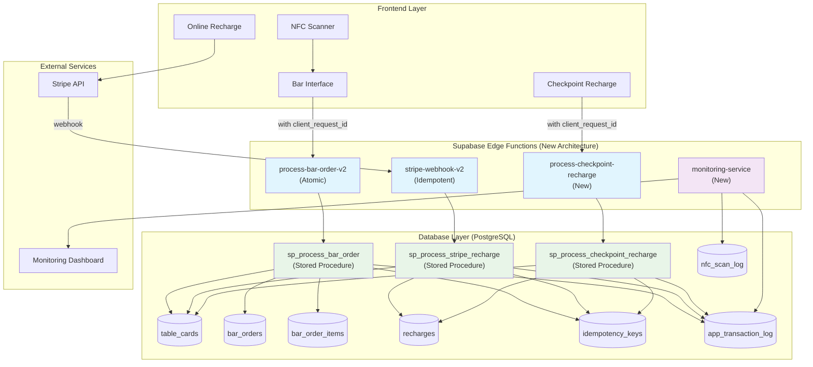

# Comprehensive Implementation Plan for Cashless Festival Payment System Enhancement

## 🎯 Executive Summary

The current system suffers from critical race conditions, lack of atomicity, and no idempotency mechanisms. This plan addresses these issues by implementing a complete architectural overhaul with centralized Supabase Edge Functions, atomic stored procedures, and comprehensive monitoring.

## 🔍 Current System Analysis

**Critical Issues Identified:**

1. **Race Conditions in [`supabase/functions/process-bar-order/index.ts`](supabase/functions/process-bar-order/index.ts:188)**: Sequential database operations without proper transaction isolation
2. **Stripe Webhook Vulnerabilities in [`supabase/functions/stripe-webhook/index.ts`](supabase/functions/stripe-webhook/index.ts:89)**: Duplicate processing risk and balance inconsistencies
3. **NFC Duplicate Processing in [`src/hooks/use-nfc.tsx`](src/hooks/use-nfc.tsx:216)**: Client-side debouncing only, no backend protection
4. **No Idempotency Mechanism**: Missing protection against duplicate requests
5. **Insufficient Monitoring**: Limited transaction logging and error tracking

## 🏗️ Proposed Architecture



## 📋 Implementation Phases

### Phase 1: Database Schema & Stored Procedures (Weeks 1-2)

#### 1.1 Database Schema Creation

**New Tables:**

```sql
-- Idempotency protection
CREATE TABLE idempotency_keys (
    request_id TEXT PRIMARY KEY,
    source_function TEXT NOT NULL,
    status TEXT NOT NULL CHECK (status IN ('processing', 'completed', 'failed')),
    response_payload JSONB,
    created_at TIMESTAMPTZ DEFAULT NOW(),
    updated_at TIMESTAMPTZ DEFAULT NOW(),
    expires_at TIMESTAMPTZ DEFAULT NOW() + INTERVAL '24 hours'
);

-- Comprehensive transaction logging
CREATE TABLE app_transaction_log (
    log_id BIGSERIAL PRIMARY KEY,
    transaction_id UUID UNIQUE DEFAULT gen_random_uuid(),
    correlation_id UUID,
    card_id TEXT NOT NULL,
    transaction_type TEXT NOT NULL,
    status TEXT NOT NULL,
    amount_involved DECIMAL(10, 2),
    previous_balance DECIMAL(10, 2),
    new_balance DECIMAL(10, 2),
    details JSONB,
    edge_function_name TEXT,
    edge_function_request_id TEXT,
    client_request_id TEXT,
    timestamp TIMESTAMPTZ DEFAULT NOW()
);

-- NFC scan logging for debugging
CREATE TABLE nfc_scan_log (
    scan_log_id BIGSERIAL PRIMARY KEY,
    card_id_scanned TEXT,
    raw_data TEXT,
    scan_timestamp TIMESTAMPTZ DEFAULT NOW(),
    scan_status TEXT NOT NULL,
    scan_location_context TEXT,
    device_identifier TEXT,
    user_agent TEXT
);

-- Indexes for performance
CREATE INDEX idx_idempotency_keys_expires_at ON idempotency_keys(expires_at);
CREATE INDEX idx_transaction_log_card_id ON app_transaction_log(card_id);
CREATE INDEX idx_transaction_log_timestamp ON app_transaction_log(timestamp);
CREATE INDEX idx_nfc_scan_log_timestamp ON nfc_scan_log(scan_timestamp);
CREATE INDEX idx_nfc_scan_log_card_id ON nfc_scan_log(card_id_scanned);
```

**Schema Modifications:**

```sql
-- Add idempotency support to existing tables
ALTER TABLE recharges ADD COLUMN client_request_id TEXT UNIQUE;
ALTER TABLE recharges ADD COLUMN staff_id TEXT;
ALTER TABLE recharges ADD COLUMN checkpoint_id TEXT;
ALTER TABLE recharges ADD CONSTRAINT unique_stripe_session UNIQUE (stripe_session_id);

ALTER TABLE bar_orders ADD COLUMN client_request_id TEXT UNIQUE;

-- Add metadata column for Stripe
ALTER TABLE recharges ADD COLUMN stripe_metadata JSONB;
```

#### 1.2 Atomic Stored Procedures

**Bar Order Processing:**

```sql
CREATE OR REPLACE FUNCTION sp_process_bar_order(
    card_id_in TEXT,
    items_in JSONB,
    total_amount_in DECIMAL,
    client_request_id_in TEXT,
    point_of_sale_in INT DEFAULT 1
) RETURNS JSONB AS $$
DECLARE
    current_balance DECIMAL;
    new_balance DECIMAL;
    order_id_out INT;
    transaction_id_out UUID;
    result JSONB;
BEGIN
    -- Check idempotency
    IF EXISTS (SELECT 1 FROM idempotency_keys WHERE request_id = client_request_id_in) THEN
        SELECT response_payload INTO result 
        FROM idempotency_keys 
        WHERE request_id = client_request_id_in AND status = 'completed';
        
        IF result IS NOT NULL THEN
            RETURN result;
        END IF;
    END IF;

    -- Insert idempotency key
    INSERT INTO idempotency_keys (request_id, source_function, status)
    VALUES (client_request_id_in, 'sp_process_bar_order', 'processing')
    ON CONFLICT (request_id) DO NOTHING;

    -- Start transaction
    BEGIN
        -- Get and lock card
        SELECT amount INTO current_balance 
        FROM table_cards 
        WHERE id = card_id_in 
        FOR UPDATE;

        IF NOT FOUND THEN
            RAISE EXCEPTION 'Card not found: %', card_id_in;
        END IF;

        -- Check sufficient balance
        IF current_balance < total_amount_in THEN
            RAISE EXCEPTION 'Insufficient funds: % < %', current_balance, total_amount_in;
        END IF;

        -- Calculate new balance
        new_balance := current_balance - total_amount_in;

        -- Create order
        INSERT INTO bar_orders (card_id, total_amount, status, point_of_sale, client_request_id)
        VALUES (card_id_in, total_amount_in, 'completed', point_of_sale_in, client_request_id_in)
        RETURNING id INTO order_id_out;

        -- Create order items
        INSERT INTO bar_order_items (order_id, product_name, price, quantity, is_deposit, is_return)
        SELECT 
            order_id_out,
            item->>'name',
            (item->>'unit_price')::DECIMAL,
            (item->>'quantity')::INT,
            COALESCE((item->>'is_deposit')::BOOLEAN, false),
            COALESCE((item->>'is_return')::BOOLEAN, false)
        FROM jsonb_array_elements(items_in) AS item;

        -- Update card balance
        UPDATE table_cards 
        SET amount = new_balance 
        WHERE id = card_id_in;

        -- Log transaction
        INSERT INTO app_transaction_log (
            card_id, transaction_type, status, amount_involved,
            previous_balance, new_balance, details,
            edge_function_name, client_request_id
        ) VALUES (
            card_id_in, 'bar_order', 'completed', total_amount_in,
            current_balance, new_balance, items_in,
            'process-bar-order', client_request_id_in
        ) RETURNING transaction_id INTO transaction_id_out;

        -- Prepare result
        result := jsonb_build_object(
            'success', true,
            'order_id', order_id_out,
            'transaction_id', transaction_id_out,
            'previous_balance', current_balance,
            'new_balance', new_balance
        );

        -- Update idempotency key
        UPDATE idempotency_keys 
        SET status = 'completed', response_payload = result, updated_at = NOW()
        WHERE request_id = client_request_id_in;

        RETURN result;

    EXCEPTION WHEN OTHERS THEN
        -- Update idempotency key with error
        UPDATE idempotency_keys 
        SET status = 'failed', 
            response_payload = jsonb_build_object('error', SQLERRM),
            updated_at = NOW()
        WHERE request_id = client_request_id_in;
        
        RAISE;
    END;
END;
$$ LANGUAGE plpgsql;
```

**Stripe Recharge Processing:**

```sql
CREATE OR REPLACE FUNCTION sp_process_stripe_recharge(
    card_id_in TEXT,
    amount_in DECIMAL,
    stripe_session_id_in TEXT,
    stripe_metadata_in JSONB
) RETURNS JSONB AS $$
DECLARE
    current_balance DECIMAL;
    new_balance DECIMAL;
    transaction_id_out UUID;
    result JSONB;
BEGIN
    -- Check for duplicate Stripe session
    IF EXISTS (SELECT 1 FROM recharges WHERE stripe_session_id = stripe_session_id_in) THEN
        RETURN jsonb_build_object(
            'success', false,
            'error', 'Duplicate Stripe session',
            'stripe_session_id', stripe_session_id_in
        );
    END IF;

    -- Start transaction
    BEGIN
        -- Get and lock card
        SELECT amount INTO current_balance 
        FROM table_cards 
        WHERE id = card_id_in 
        FOR UPDATE;

        IF NOT FOUND THEN
            RAISE EXCEPTION 'Card not found: %', card_id_in;
        END IF;

        -- Calculate new balance
        new_balance := current_balance + amount_in;

        -- Create recharge record
        INSERT INTO recharges (
            id_card, amount, paid_by_card, stripe_session_id,
            stripe_metadata, created_at
        ) VALUES (
            card_id_in, amount_in, true, stripe_session_id_in,
            stripe_metadata_in, NOW()
        );

        -- Update card balance
        UPDATE table_cards 
        SET amount = new_balance 
        WHERE id = card_id_in;

        -- Log transaction
        INSERT INTO app_transaction_log (
            card_id, transaction_type, status, amount_involved,
            previous_balance, new_balance, details,
            edge_function_name
        ) VALUES (
            card_id_in, 'stripe_recharge', 'completed', amount_in,
            current_balance, new_balance, stripe_metadata_in,
            'stripe-webhook'
        ) RETURNING transaction_id INTO transaction_id_out;

        -- Prepare result
        result := jsonb_build_object(
            'success', true,
            'transaction_id', transaction_id_out,
            'previous_balance', current_balance,
            'new_balance', new_balance,
            'stripe_session_id', stripe_session_id_in
        );

        RETURN result;

    EXCEPTION WHEN OTHERS THEN
        RAISE;
    END;
END;
$$ LANGUAGE plpgsql;
```

**Checkpoint Recharge Processing:**

```sql
CREATE OR REPLACE FUNCTION sp_process_checkpoint_recharge(
    card_id_in TEXT,
    amount_in DECIMAL,
    payment_method_in TEXT,
    staff_id_in TEXT,
    client_request_id_in TEXT,
    checkpoint_id_in TEXT
) RETURNS JSONB AS $$
DECLARE
    current_balance DECIMAL;
    new_balance DECIMAL;
    transaction_id_out UUID;
    result JSONB;
BEGIN
    -- Check idempotency
    IF EXISTS (SELECT 1 FROM idempotency_keys WHERE request_id = client_request_id_in) THEN
        SELECT response_payload INTO result 
        FROM idempotency_keys 
        WHERE request_id = client_request_id_in AND status = 'completed';
        
        IF result IS NOT NULL THEN
            RETURN result;
        END IF;
    END IF;

    -- Insert idempotency key
    INSERT INTO idempotency_keys (request_id, source_function, status)
    VALUES (client_request_id_in, 'sp_process_checkpoint_recharge', 'processing')
    ON CONFLICT (request_id) DO NOTHING;

    -- Start transaction
    BEGIN
        -- Get and lock card
        SELECT amount INTO current_balance 
        FROM table_cards 
        WHERE id = card_id_in 
        FOR UPDATE;

        IF NOT FOUND THEN
            RAISE EXCEPTION 'Card not found: %', card_id_in;
        END IF;

        -- Calculate new balance
        new_balance := current_balance + amount_in;

        -- Create recharge record
        INSERT INTO recharges (
            id_card, amount, paid_by_card, staff_id, checkpoint_id,
            client_request_id, created_at
        ) VALUES (
            card_id_in, amount_in, (payment_method_in = 'card'), 
            staff_id_in, checkpoint_id_in, client_request_id_in, NOW()
        );

        -- Update card balance
        UPDATE table_cards 
        SET amount = new_balance 
        WHERE id = card_id_in;

        -- Log transaction
        INSERT INTO app_transaction_log (
            card_id, transaction_type, status, amount_involved,
            previous_balance, new_balance, details,
            edge_function_name, client_request_id
        ) VALUES (
            card_id_in, 'checkpoint_recharge', 'completed', amount_in,
            current_balance, new_balance, 
            jsonb_build_object('payment_method', payment_method_in, 'staff_id', staff_id_in),
            'process-checkpoint-recharge', client_request_id_in
        ) RETURNING transaction_id INTO transaction_id_out;

        -- Prepare result
        result := jsonb_build_object(
            'success', true,
            'transaction_id', transaction_id_out,
            'previous_balance', current_balance,
            'new_balance', new_balance
        );

        -- Update idempotency key
        UPDATE idempotency_keys 
        SET status = 'completed', response_payload = result, updated_at = NOW()
        WHERE request_id = client_request_id_in;

        RETURN result;

    EXCEPTION WHEN OTHERS THEN
        -- Update idempotency key with error
        UPDATE idempotency_keys 
        SET status = 'failed', 
            response_payload = jsonb_build_object('error', SQLERRM),
            updated_at = NOW()
        WHERE request_id = client_request_id_in;
        
        RAISE;
    END;
END;
$$ LANGUAGE plpgsql;
```

### Phase 2: Enhanced Edge Functions (Weeks 3-4)

#### 2.1 New Bar Order Edge Function

```typescript
// supabase/functions/process-bar-order-v2/index.ts
import { serve } from 'https://deno.land/std@0.168.0/http/server.ts'
import { createClient } from 'https://esm.sh/@supabase/supabase-js@2'

interface BarOrderRequest {
  card_id: string;
  items: Array<{
    product_id: number;
    quantity: number;
    unit_price: number;
    name: string;
    is_deposit?: boolean;
    is_return?: boolean;
  }>;
  total_amount: number;
  point_of_sale?: number;
  client_request_id: string; // Required for idempotency
}

serve(async (req) => {
  const requestId = crypto.randomUUID();
  console.log(`[${requestId}] Bar order processing started`);

  try {
    const requestBody = await req.json() as BarOrderRequest;
    const { card_id, items, total_amount, point_of_sale = 1, client_request_id } = requestBody;

    // Validate required fields
    if (!card_id || !items || !total_amount || !client_request_id) {
      return new Response(
        JSON.stringify({ 
          success: false, 
          error: 'Missing required fields: card_id, items, total_amount, client_request_id' 
        }),
        { headers: { 'Content-Type': 'application/json' }, status: 400 }
      );
    }

    // Create Supabase client
    const supabase = createClient(
      Deno.env.get('SUPABASE_URL') ?? '',
      Deno.env.get('SUPABASE_SERVICE_ROLE_KEY') ?? '',
      { auth: { persistSession: false } }
    );

    // Call atomic stored procedure
    const { data, error } = await supabase.rpc('sp_process_bar_order', {
      card_id_in: card_id,
      items_in: items,
      total_amount_in: total_amount,
      client_request_id_in: client_request_id,
      point_of_sale_in: point_of_sale
    });

    if (error) {
      console.error(`[${requestId}] Stored procedure error:`, error);
      return new Response(
        JSON.stringify({ 
          success: false, 
          error: error.message,
          details: error
        }),
        { headers: { 'Content-Type': 'application/json' }, status: 400 }
      );
    }

    console.log(`[${requestId}] Order processed successfully:`, data);
    return new Response(
      JSON.stringify(data),
      { headers: { 'Content-Type': 'application/json' } }
    );

  } catch (error) {
    console.error(`[${requestId}] Unexpected error:`, error);
    return new Response(
      JSON.stringify({ 
        success: false, 
        error: 'Internal server error',
        details: error.message 
      }),
      { headers: { 'Content-Type': 'application/json' }, status: 500 }
    );
  }
});
```

### Phase 3: Frontend Integration (Weeks 5-6)

#### 3.1 Enhanced NFC Hook with Backend Debouncing

```typescript
// src/hooks/use-nfc-v2.tsx
import { useState, useRef, useEffect, useCallback } from 'react';
import { toast } from '@/hooks/use-toast';
import { logger } from '@/lib/logger';

interface UseNfcOptions {
  onScan?: (id: string) => void;
  validateId?: (id: string) => boolean;
  getTotalAmount?: () => number;
  debounceMs?: number;
}

export function useNfcV2({ 
  onScan, 
  validateId, 
  getTotalAmount,
  debounceMs = 2000 
}: UseNfcOptions = {}) {
  const [isScanning, setIsScanning] = useState(false);
  const [isSupported, setIsSupported] = useState<boolean | null>(null);
  const [lastScannedId, setLastScannedId] = useState<string | null>(null);
  const [scanState, setScanState] = useState<'idle' | 'scanning' | 'processing' | 'cooldown'>('idle');
  
  const nfcAbortController = useRef<AbortController | null>(null);
  const lastScanTime = useRef<number>(0);
  const processingCards = useRef<Set<string>>(new Set());

  // Enhanced debouncing with backend coordination
  const shouldProcessScan = useCallback((cardId: string): boolean => {
    const now = Date.now();
    const timeSinceLastScan = now - lastScanTime.current;
    
    // Client-side debouncing
    if (timeSinceLastScan < debounceMs) {
      logger.nfc('Scan debounced (client-side)', { cardId, timeSinceLastScan });
      return false;
    }
    
    // Check if card is currently being processed
    if (processingCards.current.has(cardId)) {
      logger.nfc('Card already being processed', { cardId });
      return false;
    }
    
    return true;
  }, [debounceMs]);

  return {
    isScanning,
    isSupported,
    lastScannedId,
    scanState,
    startScan: () => {}, // Implementation details
    stopScan: () => {}   // Implementation details
  };
}
```

### Phase 4: Monitoring & Alerting (Week 7)

#### 4.1 Monitoring Edge Function

```typescript
// supabase/functions/monitoring-service/index.ts
import { serve } from 'https://deno.land/std@0.168.0/http/server.ts'
import { createClient } from 'https://esm.sh/@supabase/supabase-js@2'

serve(async (req) => {
  const supabase = createClient(
    Deno.env.get('SUPABASE_URL') ?? '',
    Deno.env.get('SUPABASE_SERVICE_ROLE_KEY') ?? '',
    { auth: { persistSession: false } }
  );

  try {
    // Check for anomalies in the last hour
    const oneHourAgo = new Date(Date.now() - 60 * 60 * 1000).toISOString();
    
    // Detect failed transactions
    const { data: failedTransactions } = await supabase
      .from('app_transaction_log')
      .select('*')
      .eq('status', 'failed')
      .gte('timestamp', oneHourAgo);

    // Detect duplicate NFC scans
    const { data: duplicateScans } = await supabase
      .from('nfc_scan_log')
      .select('card_id_scanned, count(*)')
      .gte('scan_timestamp', oneHourAgo)
      .group('card_id_scanned')
      .having('count(*) > 10'); // More than 10 scans per hour

    const alerts = [];
    
    if (failedTransactions?.length > 5) {
      alerts.push({
        type: 'high_failure_rate',
        count: failedTransactions.length,
        severity: 'high'
      });
    }

    if (duplicateScans?.length > 0) {
      alerts.push({
        type: 'excessive_nfc_scans',
        cards: duplicateScans,
        severity: 'medium'
      });
    }

    return new Response(JSON.stringify({
      status: 'healthy',
      alerts,
      timestamp: new Date().toISOString()
    }), {
      headers: { 'Content-Type': 'application/json' }
    });

  } catch (error) {
    return new Response(JSON.stringify({
      status: 'error',
      error: error.message
    }), {
      headers: { 'Content-Type': 'application/json' },
      status: 500
    });
  }
});
```

### Phase 5: Load Testing & Validation (Week 8)

#### 5.1 Enhanced Load Testing Framework

```javascript
// load-tests/full-festival-simulation-production.js
import http from 'k6/http';
import { check, sleep, group } from 'k6';
import { Rate, Trend, Counter } from 'k6/metrics';

// Custom metrics for the new architecture
const atomicTransactionSuccess = new Rate('atomic_transaction_success');
const idempotencyHits = new Counter('idempotency_hits');
const raceConditionDetected = new Counter('race_condition_detected');
const balanceConsistencyCheck = new Rate('balance_consistency_check');

export const options = {
  scenarios: {
    festival_simulation: {
      executor: 'ramping-arrival-rate',
      startRate: 10,
      timeUnit: '1s',
      preAllocatedVUs: 50,
      maxVUs: 100,
      stages: [
        { duration: '2m', target: 20 },   // Festival opening
        { duration: '5m', target: 50 },   // Peak hours
        { duration: '3m', target: 80 },   // Rush period
        { duration: '2m', target: 20 },   // Wind down
      ],
    }
  },
  thresholds: {
    'atomic_transaction_success': ['rate>0.95'],
    'balance_consistency_check': ['rate>0.99'],
    'http_req_duration': ['p(95)<3000'],
  }
};

export default function() {
  // Test concurrent bar orders with same card
  group('Concurrent Bar Orders', function() {
    const cardId = `test-card-${Math.floor(Math.random() * 100)}`;
    const clientRequestId = `load-test-${Date.now()}-${Math.random()}`;
    
    const response = http.post(`${BASE_URL}/functions/v1/process-bar-order-v2`, 
      JSON.stringify({
        card_id: cardId,
        items: [{ name: 'Beer', unit_price: 5, quantity: 1 }],
        total_amount: 5,
        client_request_id: clientRequestId
      }), {
        headers: {
          'Content-Type': 'application/json',
          'Authorization': `Bearer ${getAuthToken()}`
        }
      }
    );

    const success = check(response, {
      'transaction processed atomically': (r) => r.status === 200,
      'response contains transaction_id': (r) => r.json('transaction_id') !== undefined
    });

    atomicTransactionSuccess.add(success ? 1 : 0);
  });

  sleep(Math.random() * 2);
}
```

## 📊 Success Metrics & Validation

### Key Performance Indicators

1. **Transaction Atomicity**: 99.9% success rate for atomic operations
2. **Idempotency Protection**: 100% duplicate request handling
3. **Race Condition Elimination**: Zero balance inconsistencies
4. **NFC Debouncing**: <1% duplicate scan processing
5. **System Performance**: <3s response time for 95% of requests
6. **Error Rate**: <1% failed transactions under normal load

### Validation Procedures

1. **Unit Testing**: All stored procedures with edge cases
2. **Integration Testing**: End-to-end transaction flows
3. **Load Testing**: Concurrent operations simulation
4. **Chaos Testing**: Network failures and database locks
5. **Production Monitoring**: Real-time alerting and dashboards

## 🚀 Deployment Strategy

### Deployment Phases

1. **Database Migration**: Schema updates with zero downtime
2. **Edge Function Deployment**: Blue-green deployment strategy
3. **Frontend Rollout**: Feature flags for gradual rollout
4. **Monitoring Setup**: Real-time dashboards and alerting
5. **Load Testing**: Production environment validation

### Rollback Plan

1. **Database Rollback**: Automated schema rollback scripts
2. **Edge Function Rollback**: Instant version switching
3. **Frontend Rollback**: Feature flag disabling
4. **Data Consistency**: Transaction log replay capabilities

## 📋 Implementation Checklist

### Phase 1: Database (Weeks 1-2)
- [ ] Create new tables (idempotency_keys, app_transaction_log, nfc_scan_log)
- [ ] Modify existing tables (add client_request_id columns)
- [ ] Implement stored procedures (sp_process_bar_order, sp_process_stripe_recharge, sp_process_checkpoint_recharge)
- [ ] Create database indexes for performance
- [ ] Unit test all stored procedures

### Phase 2: Edge Functions (Weeks 3-4)
- [ ] Implement process-bar-order-v2 Edge Function
- [ ] Implement stripe-webhook-v2 Edge Function
- [ ] Implement process-checkpoint-recharge Edge Function
- [ ] Add comprehensive error handling and logging
- [ ] Integration testing with stored procedures

### Phase 3: Frontend (Weeks 5-6)
- [ ] Enhance NFC hook with backend debouncing
- [ ] Update bar payment components
- [ ] Update recharge components
- [ ] Add client request ID generation
- [ ] Implement proper error handling and user feedback

### Phase 4: Monitoring (Week 7)
- [ ] Implement monitoring Edge Function
- [ ] Set up real-time alerting
- [ ] Create monitoring dashboard
- [ ] Configure anomaly detection
- [ ] Test alerting mechanisms

### Phase 5: Testing & Deployment (Week 8)
- [ ] Enhanced load testing framework
- [ ] Production environment testing
- [ ] Performance validation
- [ ] Security testing
- [ ] Final deployment and monitoring

## 🎯 Expected Outcomes

1. **Eliminated Race Conditions**: Atomic transactions prevent all race conditions
2. **Idempotent Operations**: Duplicate requests handled gracefully
3. **Enhanced NFC Experience**: Smooth, debounced NFC interactions
4. **Real-time Monitoring**: Comprehensive system visibility
5. **Improve