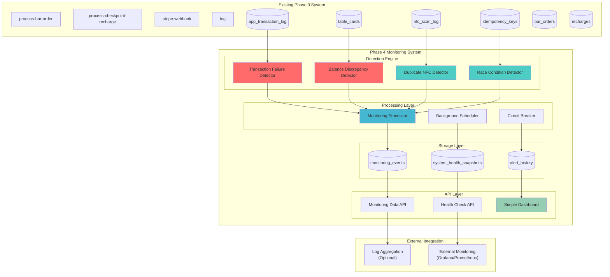
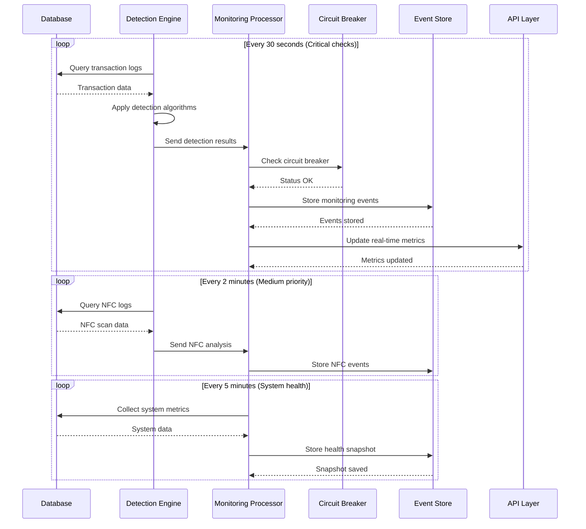

# Phase 4 Production Monitoring System - Comprehensive Architecture Design

## 🎯 Executive Summary

This document presents a comprehensive architectural design for Phase 4 production monitoring system for the cashless NFC festival payment platform. The system prioritizes **financial integrity** and **transaction failure detection** while maintaining simplicity and production readiness for a high-volume festival environment (6,000+ daily transactions, 2,000 participants, 100+ concurrent users).

## 📊 System Architecture Overview



## 🏗️ Component Architecture

### 1. Detection Engine Components

#### 1.1 Transaction Failure Detector (Priority: CRITICAL)

**Purpose**: Monitor and detect transaction failures to prevent financial loss

**Detection Algorithm**:
```typescript
interface TransactionFailureDetection {
  // Real-time failure detection
  detectFailedTransactions(): Promise<FailureEvent[]>;
  
  // Pattern analysis
  analyzeFailurePatterns(): Promise<FailurePattern[]>;
  
  // Balance integrity validation
  validateBalanceIntegrity(): Promise<BalanceDiscrepancy[]>;
}

// Detection criteria
const FAILURE_DETECTION_RULES = {
  // Critical: Transaction marked as failed but balance was deducted
  BALANCE_DEDUCTED_ON_FAILURE: {
    severity: 'CRITICAL',
    query: `
      SELECT t.*, c.amount as current_balance
      FROM app_transaction_log t
      JOIN table_cards c ON c.id = t.card_id
      WHERE t.status = 'failed' 
        AND t.new_balance != t.previous_balance
        AND t.timestamp > NOW() - INTERVAL '5 minutes'
    `
  },
  
  // High: Multiple consecutive failures for same card
  CONSECUTIVE_FAILURES: {
    severity: 'HIGH',
    threshold: 3,
    timeWindow: '10 minutes'
  },
  
  // Medium: High failure rate across system
  SYSTEM_FAILURE_RATE: {
    severity: 'MEDIUM',
    threshold: 0.05, // 5% failure rate
    timeWindow: '15 minutes'
  }
};
```

#### 1.2 Balance Discrepancy Detector (Priority: CRITICAL)

**Purpose**: Detect inconsistencies between expected and actual card balances

**Detection Algorithm**:
```typescript
interface BalanceDiscrepancyDetection {
  // Real-time balance validation
  validateCardBalances(): Promise<BalanceDiscrepancy[]>;
  
  // Reconciliation checks
  performReconciliation(): Promise<ReconciliationResult>;
  
  // Audit trail verification
  verifyAuditTrail(): Promise<AuditDiscrepancy[]>;
}

// Balance validation logic
const BALANCE_VALIDATION_RULES = {
  // Critical: Card balance doesn't match transaction history
  BALANCE_MISMATCH: {
    severity: 'CRITICAL',
    query: `
      WITH calculated_balance AS (
        SELECT 
          card_id,
          SUM(CASE 
            WHEN transaction_type IN ('stripe_recharge', 'checkpoint_recharge') THEN amount_involved
            WHEN transaction_type = 'bar_order' THEN -amount_involved
            ELSE 0
          END) as expected_balance
        FROM app_transaction_log
        WHERE status = 'completed'
        GROUP BY card_id
      )
      SELECT 
        c.id,
        c.amount as actual_balance,
        cb.expected_balance,
        ABS(c.amount - cb.expected_balance) as discrepancy
      FROM table_cards c
      JOIN calculated_balance cb ON cb.card_id = c.id
      WHERE ABS(c.amount - cb.expected_balance) > 0.01
    `
  },
  
  // High: Negative balance (should be impossible)
  NEGATIVE_BALANCE: {
    severity: 'HIGH',
    query: `SELECT * FROM table_cards WHERE amount < 0`
  }
};
```

#### 1.3 Duplicate NFC Detector (Priority: MEDIUM)

**Purpose**: Detect and prevent duplicate NFC scan processing

**Detection Algorithm**:
```typescript
interface DuplicateNFCDetection {
  // Temporal correlation analysis
  detectTemporalDuplicates(): Promise<DuplicateEvent[]>;
  
  // Pattern recognition
  identifyDuplicatePatterns(): Promise<DuplicatePattern[]>;
}

const DUPLICATE_DETECTION_RULES = {
  // Same card scanned multiple times within short window
  TEMPORAL_DUPLICATES: {
    severity: 'MEDIUM',
    timeWindow: 5, // seconds
    query: `
      SELECT 
        card_id_scanned,
        COUNT(*) as scan_count,
        array_agg(scan_log_id ORDER BY scan_timestamp) as scan_ids,
        MAX(scan_timestamp) - MIN(scan_timestamp) as time_span
      FROM nfc_scan_log
      WHERE scan_timestamp > NOW() - INTERVAL '1 minute'
        AND card_id_scanned IS NOT NULL
      GROUP BY card_id_scanned
      HAVING COUNT(*) > 1 
        AND MAX(scan_timestamp) - MIN(scan_timestamp) < INTERVAL '5 seconds'
    `
  }
};
```

#### 1.4 Race Condition Detector (Priority: MEDIUM)

**Purpose**: Monitor for suspicious overlapping transactions

**Detection Algorithm**:
```typescript
interface RaceConditionDetection {
  // Concurrent transaction detection
  detectConcurrentTransactions(): Promise<RaceConditionEvent[]>;
  
  // Lock contention analysis
  analyzeLockContention(): Promise<LockContentionEvent[]>;
}

const RACE_CONDITION_RULES = {
  // Multiple transactions for same card within very short interval
  CONCURRENT_TRANSACTIONS: {
    severity: 'MEDIUM',
    timeWindow: 2, // seconds
    query: `
      SELECT 
        card_id,
        COUNT(*) as concurrent_count,
        array_agg(transaction_id ORDER BY timestamp) as transaction_ids
      FROM app_transaction_log
      WHERE timestamp > NOW() - INTERVAL '30 seconds'
      GROUP BY card_id, DATE_TRUNC('second', timestamp)
      HAVING COUNT(*) > 1
    `
  }
};
```

### 2. Processing Layer Architecture

#### 2.1 Monitoring Processor

**Purpose**: Central processing engine for all monitoring events

```typescript
class MonitoringProcessor {
  private detectors: DetectionEngine[];
  private circuitBreaker: CircuitBreaker;
  private eventStore: EventStore;
  
  async processMonitoringCycle(): Promise<ProcessingResult> {
    const startTime = Date.now();
    
    try {
      // Run all detectors in parallel with timeout
      const detectionPromises = this.detectors.map(detector => 
        this.runDetectorWithTimeout(detector, 30000) // 30s timeout
      );
      
      const results = await Promise.allSettled(detectionPromises);
      
      // Aggregate results
      const events = this.aggregateDetectionResults(results);
      
      // Store events
      await this.eventStore.storeEvents(events);
      
      // Update system health
      await this.updateSystemHealth(events);
      
      return {
        success: true,
        eventsDetected: events.length,
        processingTime: Date.now() - startTime
      };
      
    } catch (error) {
      await this.circuitBreaker.recordFailure(error);
      throw error;
    }
  }
  
  private async runDetectorWithTimeout(
    detector: DetectionEngine, 
    timeout: number
  ): Promise<MonitoringEvent[]> {
    return Promise.race([
      detector.detect(),
      new Promise<never>((_, reject) => 
        setTimeout(() => reject(new Error('Detection timeout')), timeout)
      )
    ]);
  }
}
```

#### 2.2 Background Scheduler

**Purpose**: Manage monitoring frequency and resource usage

```typescript
class BackgroundScheduler {
  private schedules = {
    // Critical financial checks - every 30 seconds
    TRANSACTION_FAILURES: { interval: 30000, priority: 'HIGH' },
    BALANCE_DISCREPANCIES: { interval: 30000, priority: 'HIGH' },
    
    // Medium priority checks - every 2 minutes
    DUPLICATE_NFC: { interval: 120000, priority: 'MEDIUM' },
    RACE_CONDITIONS: { interval: 120000, priority: 'MEDIUM' },
    
    // System health - every 5 minutes
    SYSTEM_HEALTH: { interval: 300000, priority: 'LOW' },
    
    // Cleanup - every hour
    CLEANUP: { interval: 3600000, priority: 'MAINTENANCE' }
  };
  
  async start(): Promise<void> {
    // Stagger startup to avoid resource contention
    for (const [name, config] of Object.entries(this.schedules)) {
      setTimeout(() => {
        this.scheduleDetector(name, config);
      }, Math.random() * 10000); // Random delay up to 10s
    }
  }
}
```

#### 2.3 Circuit Breaker Pattern

**Purpose**: Prevent monitoring system failures from affecting core operations

```typescript
class CircuitBreaker {
  private state: 'CLOSED' | 'OPEN' | 'HALF_OPEN' = 'CLOSED';
  private failureCount = 0;
  private lastFailureTime = 0;
  
  private readonly FAILURE_THRESHOLD = 5;
  private readonly RECOVERY_TIMEOUT = 60000; // 1 minute
  
  async execute<T>(operation: () => Promise<T>): Promise<T> {
    if (this.state === 'OPEN') {
      if (Date.now() - this.lastFailureTime > this.RECOVERY_TIMEOUT) {
        this.state = 'HALF_OPEN';
      } else {
        throw new Error('Circuit breaker is OPEN');
      }
    }
    
    try {
      const result = await operation();
      this.onSuccess();
      return result;
    } catch (error) {
      this.onFailure();
      throw error;
    }
  }
  
  private onSuccess(): void {
    this.failureCount = 0;
    this.state = 'CLOSED';
  }
  
  private onFailure(): void {
    this.failureCount++;
    this.lastFailureTime = Date.now();
    
    if (this.failureCount >= this.FAILURE_THRESHOLD) {
      this.state = 'OPEN';
    }
  }
}
```

## 🗄️ Database Schema Design

### 3.1 Monitoring Events Table

```sql
-- Core monitoring events storage
CREATE TABLE monitoring_events (
    event_id BIGSERIAL PRIMARY KEY,
    event_type TEXT NOT NULL CHECK (event_type IN (
        'transaction_failure', 'balance_discrepancy', 
        'duplicate_nfc', 'race_condition', 'system_health'
    )),
    severity TEXT NOT NULL CHECK (severity IN (
        'CRITICAL', 'HIGH', 'MEDIUM', 'LOW', 'INFO'
    )),
    
    -- Event details
    card_id TEXT,
    transaction_id UUID,
    affected_amount DECIMAL(10, 2),
    
    -- Detection metadata
    detection_timestamp TIMESTAMPTZ DEFAULT NOW(),
    detection_algorithm TEXT NOT NULL,
    confidence_score DECIMAL(3, 2) DEFAULT 1.0, -- 0.0 to 1.0
    
    -- Event data
    event_data JSONB NOT NULL DEFAULT '{}',
    context_data JSONB DEFAULT '{}',
    
    -- Resolution tracking
    status TEXT DEFAULT 'OPEN' CHECK (status IN (
        'OPEN', 'INVESTIGATING', 'RESOLVED', 'FALSE_POSITIVE'
    )),
    resolved_at TIMESTAMPTZ,
    resolution_notes TEXT,
    
    -- Indexing and performance
    created_at TIMESTAMPTZ DEFAULT NOW(),
    updated_at TIMESTAMPTZ DEFAULT NOW()
);

-- Performance indexes
CREATE INDEX idx_monitoring_events_timestamp ON monitoring_events(detection_timestamp);
CREATE INDEX idx_monitoring_events_type_severity ON monitoring_events(event_type, severity);
CREATE INDEX idx_monitoring_events_card_id ON monitoring_events(card_id);
CREATE INDEX idx_monitoring_events_status ON monitoring_events(status);
```

### 3.2 System Health Snapshots

```sql
-- System health tracking
CREATE TABLE system_health_snapshots (
    snapshot_id BIGSERIAL PRIMARY KEY,
    snapshot_timestamp TIMESTAMPTZ DEFAULT NOW(),
    
    -- Transaction metrics
    total_transactions_last_hour INTEGER DEFAULT 0,
    successful_transactions_last_hour INTEGER DEFAULT 0,
    failed_transactions_last_hour INTEGER DEFAULT 0,
    success_rate_percent DECIMAL(5, 2),
    
    -- Performance metrics
    avg_processing_time_ms INTEGER,
    p95_processing_time_ms INTEGER,
    max_processing_time_ms INTEGER,
    
    -- NFC metrics
    total_nfc_scans_last_hour INTEGER DEFAULT 0,
    duplicate_nfc_scans_last_hour INTEGER DEFAULT 0,
    nfc_success_rate_percent DECIMAL(5, 2),
    
    -- System metrics
    active_cards_count INTEGER,
    total_system_balance DECIMAL(12, 2),
    monitoring_events_last_hour INTEGER DEFAULT 0,
    critical_events_last_hour INTEGER DEFAULT 0,
    
    -- Health status
    overall_health_status TEXT CHECK (overall_health_status IN (
        'HEALTHY', 'WARNING', 'CRITICAL', 'UNKNOWN'
    )) DEFAULT 'UNKNOWN',
    
    -- Additional metrics
    metrics_data JSONB DEFAULT '{}'
);

-- Retention policy - keep 30 days of snapshots
CREATE INDEX idx_system_health_timestamp ON system_health_snapshots(snapshot_timestamp);
```

### 3.3 Alert History

```sql
-- Alert tracking and escalation
CREATE TABLE alert_history (
    alert_id BIGSERIAL PRIMARY KEY,
    monitoring_event_id BIGINT REFERENCES monitoring_events(event_id),
    
    -- Alert details
    alert_level TEXT NOT NULL CHECK (alert_level IN (
        'INFO', 'WARNING', 'CRITICAL', 'EMERGENCY'
    )),
    alert_message TEXT NOT NULL,
    alert_timestamp TIMESTAMPTZ DEFAULT NOW(),
    
    -- Escalation tracking
    escalation_level INTEGER DEFAULT 0,
    escalated_at TIMESTAMPTZ,
    acknowledged_at TIMESTAMPTZ,
    acknowledged_by TEXT,
    
    -- Resolution
    resolved_at TIMESTAMPTZ,
    resolution_time_seconds INTEGER,
    
    -- Metadata
    alert_data JSONB DEFAULT '{}'
);
```

## 🔧 Detection Algorithm Specifications

### 4.1 Transaction Failure Detection Algorithm

```typescript
class TransactionFailureDetector implements DetectionEngine {
  async detect(): Promise<MonitoringEvent[]> {
    const events: MonitoringEvent[] = [];
    
    // 1. Critical: Balance deducted on failed transaction
    const balanceDeductionFailures = await this.detectBalanceDeductionOnFailure();
    events.push(...balanceDeductionFailures);
    
    // 2. High: Consecutive failures for same card
    const consecutiveFailures = await this.detectConsecutiveFailures();
    events.push(...consecutiveFailures);
    
    // 3. Medium: System-wide failure rate spike
    const systemFailureSpike = await this.detectSystemFailureSpike();
    events.push(...systemFailureSpike);
    
    return events;
  }
  
  private async detectBalanceDeductionOnFailure(): Promise<MonitoringEvent[]> {
    const query = `
      SELECT 
        t.transaction_id,
        t.card_id,
        t.amount_involved,
        t.previous_balance,
        t.new_balance,
        c.amount as current_balance,
        t.timestamp,
        t.details
      FROM app_transaction_log t
      JOIN table_cards c ON c.id = t.card_id
      WHERE t.status = 'failed' 
        AND t.new_balance != t.previous_balance
        AND t.timestamp > NOW() - INTERVAL '5 minutes'
    `;
    
    const results = await this.database.query(query);
    
    return results.map(row => ({
      event_type: 'transaction_failure',
      severity: 'CRITICAL',
      card_id: row.card_id,
      transaction_id: row.transaction_id,
      affected_amount: row.amount_involved,
      detection_algorithm: 'balance_deduction_on_failure',
      confidence_score: 1.0,
      event_data: {
        previous_balance: row.previous_balance,
        new_balance: row.new_balance,
        current_balance: row.current_balance,
        discrepancy: row.previous_balance - row.new_balance
      },
      context_data: {
        transaction_details: row.details,
        detection_time: new Date().toISOString()
      }
    }));
  }
  
  private async detectConsecutiveFailures(): Promise<MonitoringEvent[]> {
    const query = `
      WITH consecutive_failures AS (
        SELECT 
          card_id,
          COUNT(*) as failure_count,
          array_agg(transaction_id ORDER BY timestamp) as failed_transactions,
          MIN(timestamp) as first_failure,
          MAX(timestamp) as last_failure
        FROM app_transaction_log
        WHERE status = 'failed'
          AND timestamp > NOW() - INTERVAL '10 minutes'
        GROUP BY card_id
        HAVING COUNT(*) >= 3
      )
      SELECT * FROM consecutive_failures
    `;
    
    const results = await this.database.query(query);
    
    return results.map(row => ({
      event_type: 'transaction_failure',
      severity: 'HIGH',
      card_id: row.card_id,
      detection_algorithm: 'consecutive_failures',
      confidence_score: 0.9,
      event_data: {
        failure_count: row.failure_count,
        failed_transactions: row.failed_transactions,
        time_span_minutes: (row.last_failure - row.first_failure) / (1000 * 60)
      }
    }));
  }
}
```

### 4.2 Balance Discrepancy Detection Algorithm

```typescript
class BalanceDiscrepancyDetector implements DetectionEngine {
  async detect(): Promise<MonitoringEvent[]> {
    const events: MonitoringEvent[] = [];
    
    // 1. Critical: Balance mismatch with transaction history
    const balanceMismatches = await this.detectBalanceMismatches();
    events.push(...balanceMismatches);
    
    // 2. High: Negative balances (impossible scenario)
    const negativeBalances = await this.detectNegativeBalances();
    events.push(...negativeBalances);
    
    // 3. Medium: Large balance changes without corresponding transactions
    const unexplainedChanges = await this.detectUnexplainedBalanceChanges();
    events.push(...unexplainedChanges);
    
    return events;
  }
  
  private async detectBalanceMismatches(): Promise<MonitoringEvent[]> {
    const query = `
      WITH calculated_balances AS (
        SELECT 
          card_id,
          SUM(CASE 
            WHEN transaction_type IN ('stripe_recharge', 'checkpoint_recharge') 
              AND status = 'completed' THEN amount_involved
            WHEN transaction_type = 'bar_order' 
              AND status = 'completed' THEN -amount_involved
            ELSE 0
          END) as expected_balance,
          COUNT(*) as transaction_count,
          MAX(timestamp) as last_transaction
        FROM app_transaction_log
        GROUP BY card_id
      )
      SELECT 
        c.id as card_id,
        c.amount as actual_balance,
        COALESCE(cb.expected_balance, 0) as expected_balance,
        ABS(c.amount - COALESCE(cb.expected_balance, 0)) as discrepancy,
        cb.transaction_count,
        cb.last_transaction
      FROM table_cards c
      LEFT JOIN calculated_balances cb ON cb.card_id = c.id
      WHERE ABS(c.amount - COALESCE(cb.expected_balance, 0)) > 0.01
    `;
    
    const results = await this.database.query(query);
    
    return results.map(row => ({
      event_type: 'balance_discrepancy',
      severity: 'CRITICAL',
      card_id: row.card_id,
      affected_amount: row.discrepancy,
      detection_algorithm: 'balance_mismatch_detection',
      confidence_score: 1.0,
      event_data: {
        actual_balance: row.actual_balance,
        expected_balance: row.expected_balance,
        discrepancy: row.discrepancy,
        transaction_count: row.transaction_count
      },
      context_data: {
        last_transaction: row.last_transaction,
        requires_immediate_investigation: row.discrepancy > 10.0
      }
    }));
  }
}
```

## 🌐 API Design

### 5.1 Health Check API

```typescript
// GET /api/v1/monitoring/health
interface HealthCheckResponse {
  status: 'HEALTHY' | 'WARNING' | 'CRITICAL' | 'UNKNOWN';
  timestamp: string;
  uptime_seconds: number;
  
  // System metrics
  system_metrics: {
    transactions_last_hour: number;
    success_rate_percent: number;
    avg_processing_time_ms: number;
    active_monitoring_events: number;
    critical_events_count: number;
  };
  
  // Component health
  components: {
    transaction_detector: ComponentHealth;
    balance_detector: ComponentHealth;
    nfc_detector: ComponentHealth;
    race_detector: ComponentHealth;
    database: ComponentHealth;
    circuit_breaker: ComponentHealth;
  };
  
  // Recent alerts
  recent_alerts: AlertSummary[];
}

interface ComponentHealth {
  status: 'UP' | 'DOWN' | 'DEGRADED';
  last_check: string;
  response_time_ms?: number;
  error_message?: string;
}
```

### 5.2 Monitoring Data API

```typescript
// GET /api/v1/monitoring/events
interface MonitoringEventsResponse {
  events: MonitoringEvent[];
  pagination: {
    total: number;
    page: number;
    per_page: number;
    has_next: boolean;
  };
  filters_applied: EventFilters;
}

// GET /api/v1/monitoring/metrics
interface MetricsResponse {
  time_range: {
    start: string;
    end: string;
  };
  
  // Financial integrity metrics
  financial_metrics: {
    total_transaction_volume: number;
    failed_transaction_count: number;
    balance_discrepancies_detected: number;
    total_discrepancy_amount: number;
  };
  
  // Performance metrics
  performance_metrics: {
    avg_detection_time_ms: number;
    monitoring_cycles_completed: number;
    monitoring_errors: number;
  };
  
  // Trend data
  trends: {
    hourly_transaction_counts: TimeSeriesData[];
    failure_rates: TimeSeriesData[];
    processing_times: TimeSeriesData[];
  };
}
```

### 5.3 Simple Dashboard API

```typescript
// GET /api/v1/monitoring/dashboard
interface DashboardResponse {
  // Key indicators
  kpis: {
    system_health: 'HEALTHY' | 'WARNING' | 'CRITICAL';
    transaction_success_rate: number;
    balance_integrity_score: number;
    monitoring_system_uptime: number;
  };
  
  // Real-time data
  real_time: {
    active_transactions: number;
    recent_failures: number;
    open_monitoring_events: number;
    system_load_percent: number;
  };
  
  // Charts data
  charts: {
    transaction_volume_24h: ChartData;
    failure_rate_trend: ChartData;
    balance_discrepancy_trend: ChartData;
    nfc_duplicate_rate: ChartData;
  };
  
  // Recent events
  recent_events: MonitoringEvent[];
  
  // System status
  system_status: {
    database_connection: boolean;
    monitoring_processes: ProcessStatus[];
    last_successful_check: string;
  };
}
```

## 🔄 Data Flow Architecture

### 6.1 Real-time Processing Flow



### 6.2 Background Processing Strategy

```typescript
class BackgroundProcessingStrategy {
  private readonly PROCESSING_INTERVALS = {
    // Critical financial checks - high frequency
    CRITICAL_CHECKS: 30000,    // 30 seconds
    
    // Medium priority - moderate frequency  
    MEDIUM_CHECKS: 120000,     // 2 minutes
    
    // System health - low frequency
    HEALTH_CHECKS: 300000,     // 5 minutes
    
    // Cleanup and maintenance
    MAINTENANCE: 3600000       // 1 hour
  };
  
  async initializeProcessing(): Promise<void> {
    // Staggered startup to prevent resource contention
    await this.scheduleStaggeredProcessing();
    
    // Setup error recovery
    await this.setupErrorRecovery();
    
    // Initialize circuit breakers
    await this.initializeCircuitBreakers();
  }
  
  private async scheduleStaggeredProcessing(): Promise<void> {
    // Critical checks start immediately
    this.scheduleCriticalChecks();
    
    // Medium checks start after 15 seconds
    setTimeout(() => this.scheduleMediumChecks(), 15000);
    
    // Health checks start after 30 seconds
    setTimeout(() => this.scheduleHealthChecks(), 30000);
    
    // Maintenance starts after 60 seconds
    setTimeout(() => this.scheduleMaintenanceChecks(), 60000);
  }
}
```

## 🛡️ Error Handling and Fault Tolerance

### 7.1 Circuit Breaker Implementation

```typescript
class MonitoringCircuitBreaker {
  private circuits: Map<string, CircuitState> = new Map();
  
  private readonly CIRCUIT_CONFIG = {
    TRANSACTION_DETECTOR: {
      failureThreshold: 3,
      recoveryTimeout: 60000,
      halfOpenMaxCalls: 2
    },
    BALANCE_DETECTOR: {
      failureThreshold: 3,
      recoveryTimeout: 60000,
      halfOpenMaxCalls: 2
    },
    DATABASE_CONNECTION: {
      failureThreshold: 5,
      recoveryTimeout: 30000,
      halfOpenMaxCalls: 1
    }
  };
  
  async executeWithCircuitBreaker<T>(
    circuitName: string,
    operation: () => Promise<T>
  ): Promise<T> {
    const circuit = this.getOrCreateCircuit(circuitName);
    
    if (circuit.state === 'OPEN') {
      if (this.shouldAttemptRecovery(circuit)) {
        circuit.state = 'HALF_OPEN';
        circuit.halfOpenCalls = 0;
      } else {
        throw new Error(`Circuit breaker ${circuitName} is OPEN`);
      }
    }
    
    try {
      const result = await this.executeWithTimeout(operation, 30000);
      this.onSuccess
this.onSuccess(circuit);
      return result;
    } catch (error) {
      this.onFailure(circuit);
      throw error;
    }
  }
  
  private onSuccess(circuit: CircuitState): void {
    circuit.failureCount = 0;
    circuit.state = 'CLOSED';
  }
  
  private onFailure(circuit: CircuitState): void {
    circuit.failureCount++;
    circuit.lastFailureTime = Date.now();
    
    if (circuit.failureCount >= circuit.config.failureThreshold) {
      circuit.state = 'OPEN';
    }
  }
}
```

### 7.2 Error Recovery Mechanisms

```typescript
class ErrorRecoveryManager {
  private readonly RETRY_CONFIG = {
    maxRetries: 3,
    baseDelay: 1000,
    maxDelay: 10000,
    backoffMultiplier: 2
  };
  
  async executeWithRetry<T>(
    operation: () => Promise<T>,
    context: string
  ): Promise<T> {
    let lastError: Error;
    
    for (let attempt = 1; attempt <= this.RETRY_CONFIG.maxRetries; attempt++) {
      try {
        return await operation();
      } catch (error) {
        lastError = error as Error;
        
        if (attempt === this.RETRY_CONFIG.maxRetries) {
          throw new Error(`Operation failed after ${attempt} attempts: ${lastError.message}`);
        }
        
        const delay = Math.min(
          this.RETRY_CONFIG.baseDelay * Math.pow(this.RETRY_CONFIG.backoffMultiplier, attempt - 1),
          this.RETRY_CONFIG.maxDelay
        );
        
        console.warn(`${context} failed (attempt ${attempt}), retrying in ${delay}ms:`, error);
        await this.sleep(delay);
      }
    }
    
    throw lastError!;
  }
  
  private sleep(ms: number): Promise<void> {
    return new Promise(resolve => setTimeout(resolve, ms));
  }
}
```

## 📈 Performance and Scalability Considerations

### 8.1 Database Performance Optimization

#### Query Optimization Strategy
```sql
-- Optimized queries for high-volume monitoring
-- Use covering indexes for frequent queries
CREATE INDEX idx_monitoring_events_covering 
ON monitoring_events(detection_timestamp, event_type, severity) 
INCLUDE (card_id, affected_amount);

-- Partitioning strategy for large tables
CREATE TABLE monitoring_events_y2025m06 PARTITION OF monitoring_events
FOR VALUES FROM ('2025-06-01') TO ('2025-07-01');

-- Materialized views for dashboard queries
CREATE MATERIALIZED VIEW monitoring_dashboard_summary AS
SELECT 
  DATE_TRUNC('hour', detection_timestamp) as hour,
  event_type,
  severity,
  COUNT(*) as event_count,
  AVG(affected_amount) as avg_amount,
  SUM(affected_amount) as total_amount
FROM monitoring_events
WHERE detection_timestamp > NOW() - INTERVAL '24 hours'
GROUP BY hour, event_type, severity;

-- Refresh materialized view every 5 minutes
CREATE OR REPLACE FUNCTION refresh_monitoring_dashboard()
RETURNS void AS $$
BEGIN
  REFRESH MATERIALIZED VIEW CONCURRENTLY monitoring_dashboard_summary;
END;
$$ LANGUAGE plpgsql;
```

#### Connection Pooling Configuration
```typescript
const DATABASE_CONFIG = {
  // Connection pool settings for high concurrency
  pool: {
    min: 5,
    max: 20,
    acquireTimeoutMillis: 30000,
    createTimeoutMillis: 30000,
    destroyTimeoutMillis: 5000,
    idleTimeoutMillis: 30000,
    reapIntervalMillis: 1000,
    createRetryIntervalMillis: 200
  },
  
  // Query timeout settings
  statement_timeout: '30s',
  query_timeout: 30000,
  
  // Performance optimizations
  application_name: 'phase4_monitoring',
  search_path: 'public',
  timezone: 'UTC'
};
```

### 8.2 Memory Management

```typescript
class MemoryOptimizedProcessor {
  private readonly MAX_BATCH_SIZE = 1000;
  private readonly MEMORY_THRESHOLD = 100 * 1024 * 1024; // 100MB
  
  async processBatchedEvents(events: MonitoringEvent[]): Promise<void> {
    // Process events in batches to prevent memory issues
    for (let i = 0; i < events.length; i += this.MAX_BATCH_SIZE) {
      const batch = events.slice(i, i + this.MAX_BATCH_SIZE);
      
      await this.processBatch(batch);
      
      // Force garbage collection if memory usage is high
      if (this.getMemoryUsage() > this.MEMORY_THRESHOLD) {
        if (global.gc) {
          global.gc();
        }
      }
    }
  }
  
  private getMemoryUsage(): number {
    return process.memoryUsage().heapUsed;
  }
}
```

### 8.3 Caching Strategy

```typescript
class MonitoringCache {
  private cache = new Map<string, CacheEntry>();
  private readonly TTL = 300000; // 5 minutes
  
  async getSystemHealth(): Promise<SystemHealth> {
    const cacheKey = 'system_health';
    const cached = this.cache.get(cacheKey);
    
    if (cached && Date.now() - cached.timestamp < this.TTL) {
      return cached.data;
    }
    
    const health = await this.computeSystemHealth();
    this.cache.set(cacheKey, {
      data: health,
      timestamp: Date.now()
    });
    
    return health;
  }
  
  // Cleanup expired cache entries
  private cleanupCache(): void {
    const now = Date.now();
    for (const [key, entry] of this.cache.entries()) {
      if (now - entry.timestamp > this.TTL) {
        this.cache.delete(key);
      }
    }
  }
}
```

## 🚀 Deployment and Operational Considerations

### 9.1 Deployment Architecture

#### Recommended Deployment Strategy
```yaml
# docker-compose.yml for Phase 4 Monitoring
version: '3.8'
services:
  monitoring-processor:
    image: phase4-monitoring:latest
    environment:
      - NODE_ENV=production
      - DATABASE_URL=${DATABASE_URL}
      - MONITORING_INTERVAL_CRITICAL=30000
      - MONITORING_INTERVAL_MEDIUM=120000
    deploy:
      replicas: 2
      resources:
        limits:
          memory: 512M
          cpus: '0.5'
    healthcheck:
      test: ["CMD", "curl", "-f", "http://localhost:3000/health"]
      interval: 30s
      timeout: 10s
      retries: 3
  
  monitoring-api:
    image: phase4-monitoring-api:latest
    ports:
      - "3001:3000"
    environment:
      - NODE_ENV=production
      - DATABASE_URL=${DATABASE_URL}
    deploy:
      replicas: 2
      resources:
        limits:
          memory: 256M
          cpus: '0.25'
```

#### Edge Function Deployment
```typescript
// supabase/functions/monitoring-processor/index.ts
import { serve } from 'https://deno.land/std@0.168.0/http/server.ts'
import { MonitoringProcessor } from './monitoring-processor.ts'

serve(async (req) => {
  const processor = new MonitoringProcessor();
  
  try {
    const result = await processor.processMonitoringCycle();
    
    return new Response(JSON.stringify({
      success: true,
      ...result
    }), {
      headers: { 'Content-Type': 'application/json' }
    });
  } catch (error) {
    console.error('Monitoring processing failed:', error);
    
    return new Response(JSON.stringify({
      success: false,
      error: error.message
    }), {
      headers: { 'Content-Type': 'application/json' },
      status: 500
    });
  }
});
```

### 9.2 Monitoring System Configuration

#### Environment Configuration
```typescript
interface MonitoringConfig {
  // Detection intervals (milliseconds)
  intervals: {
    critical_checks: number;      // 30000 (30s)
    medium_checks: number;        // 120000 (2m)
    health_checks: number;        // 300000 (5m)
    cleanup: number;              // 3600000 (1h)
  };
  
  // Detection thresholds
  thresholds: {
    failure_rate_warning: number;     // 0.05 (5%)
    failure_rate_critical: number;    // 0.10 (10%)
    balance_discrepancy_threshold: number; // 0.01 (1 cent)
    consecutive_failures_threshold: number; // 3
    duplicate_scan_window_seconds: number; // 5
  };
  
  // Performance settings
  performance: {
    max_concurrent_detectors: number; // 4
    detection_timeout_ms: number;     // 30000
    batch_size: number;               // 1000
    memory_threshold_mb: number;      // 100
  };
  
  // Circuit breaker settings
  circuit_breaker: {
    failure_threshold: number;        // 5
    recovery_timeout_ms: number;      // 60000
    half_open_max_calls: number;      // 2
  };
}
```

### 9.3 Operational Procedures

#### Health Check Implementation
```typescript
class HealthCheckService {
  async performHealthCheck(): Promise<HealthCheckResult> {
    const checks = await Promise.allSettled([
      this.checkDatabaseConnection(),
      this.checkDetectorHealth(),
      this.checkCircuitBreakerStatus(),
      this.checkMemoryUsage(),
      this.checkRecentActivity()
    ]);
    
    const results = checks.map((check, index) => ({
      name: this.getCheckName(index),
      status: check.status === 'fulfilled' ? 'UP' : 'DOWN',
      details: check.status === 'fulfilled' ? check.value : check.reason
    }));
    
    const overallStatus = results.every(r => r.status === 'UP') ? 'HEALTHY' : 'CRITICAL';
    
    return {
      status: overallStatus,
      timestamp: new Date().toISOString(),
      checks: results
    };
  }
}
```

#### Maintenance Procedures
```sql
-- Daily maintenance script
DO $$
DECLARE
  cleanup_result JSONB;
  health_check RECORD;
BEGIN
  -- 1. Clean up expired monitoring data
  DELETE FROM monitoring_events 
  WHERE detection_timestamp < NOW() - INTERVAL '30 days';
  
  DELETE FROM system_health_snapshots 
  WHERE snapshot_timestamp < NOW() - INTERVAL '30 days';
  
  DELETE FROM alert_history 
  WHERE alert_timestamp < NOW() - INTERVAL '90 days';
  
  -- 2. Update table statistics
  ANALYZE monitoring_events;
  ANALYZE system_health_snapshots;
  ANALYZE alert_history;
  
  -- 3. Check for performance issues
  SELECT 
    schemaname,
    tablename,
    n_dead_tup,
    n_live_tup
  INTO health_check
  FROM pg_stat_user_tables 
  WHERE tablename = 'monitoring_events';
  
  -- 4. Vacuum if needed
  IF health_check.n_dead_tup > health_check.n_live_tup * 0.1 THEN
    VACUUM ANALYZE monitoring_events;
  END IF;
  
  RAISE NOTICE 'Daily maintenance completed successfully';
END $$;
```

## 🎯 Implementation Roadmap

### Phase 4.1: Core Detection Engine (Week 1-2)
- [ ] Implement Transaction Failure Detector
- [ ] Implement Balance Discrepancy Detector
- [ ] Create monitoring database schema
- [ ] Develop circuit breaker pattern
- [ ] Unit tests for detection algorithms

### Phase 4.2: Processing Layer (Week 3)
- [ ] Implement Monitoring Processor
- [ ] Develop Background Scheduler
- [ ] Create error recovery mechanisms
- [ ] Integration tests for processing layer

### Phase 4.3: API and Dashboard (Week 4)
- [ ] Implement Health Check API
- [ ] Develop Monitoring Data API
- [ ] Create simple dashboard interface
- [ ] API documentation and testing

### Phase 4.4: Advanced Detection (Week 5)
- [ ] Implement Duplicate NFC Detector
- [ ] Implement Race Condition Detector
- [ ] Performance optimization
- [ ] Load testing and tuning

### Phase 4.5: Production Deployment (Week 6)
- [ ] Production deployment scripts
- [ ] Monitoring system monitoring (meta-monitoring)
- [ ] Documentation and training
- [ ] Go-live and validation

## 📊 Success Metrics and KPIs

### Financial Integrity Metrics
- **Balance Discrepancy Detection Rate**: >99.9%
- **Transaction Failure Detection Time**: <30 seconds
- **False Positive Rate**: <1%
- **Financial Loss Prevention**: 100% of detectable issues

### System Performance Metrics
- **Detection Processing Time**: <5 seconds (95th percentile)
- **API Response Time**: <500ms (95th percentile)
- **System Uptime**: >99.9%
- **Database Query Performance**: <100ms average

### Operational Metrics
- **Alert Response Time**: <2 minutes for critical alerts
- **Event Resolution Time**: <15 minutes for critical events
- **Monitoring Coverage**: 100% of transaction types
- **Data Retention Compliance**: 30 days minimum

## 🔗 Integration with Existing Phase 3 Components

### Leveraging Existing Infrastructure
The Phase 4 monitoring system is designed to seamlessly integrate with the existing Phase 3 infrastructure:

1. **Database Integration**: Uses existing [`app_transaction_log`](supabase/migrations/20250614_155251_phase3_debouncing.sql:353), [`nfc_scan_log`](supabase/migrations/20250614_155251_phase3_debouncing.sql:14), and [`idempotency_keys`](supabase/migrations/20250614_155251_phase3_debouncing.sql:77) tables

2. **Edge Function Coordination**: Monitors outputs from [`process-bar-order`](supabase/functions/process-bar-order/index.ts:1), [`process-checkpoint-recharge`](supabase/functions/process-checkpoint-recharge/index.ts:1), and [`stripe-webhook`](supabase/functions/stripe-webhook/index.ts:1)

3. **NFC System Integration**: Leverages Phase 3 NFC debouncing and state machine data for duplicate detection

4. **Logging Infrastructure**: Extends the existing [`log`](supabase/functions/log/index.ts:1) edge function for monitoring event storage

## 📚 Related Documentation

- **[`COMPREHENSIVE_IMPLEMENTATION_PLAN.md`](COMPREHENSIVE_IMPLEMENTATION_PLAN.md:1)**: Overall system architecture
- **[`PHASE3_DATABASE_SCHEMA.md`](PHASE3_DATABASE_SCHEMA.md:1)**: Existing database structure
- **[`PHASE3_MONITORING_GUIDE.md`](PHASE3_MONITORING_GUIDE.md:1)**: Current monitoring capabilities
- **[`PHASE3_NFC_STATE_MACHINE.md`](PHASE3_NFC_STATE_MACHINE.md:1)**: NFC system architecture

## 🎯 Conclusion

The Phase 4 monitoring system provides a comprehensive, production-ready solution for detecting and preventing financial integrity issues in the cashless NFC festival payment platform. By prioritizing transaction failures and balance discrepancies while maintaining system simplicity, this architecture ensures robust financial protection without compromising system performance.

The modular design allows for incremental implementation and future expansion, while the strong TypeScript type system and comprehensive error handling ensure reliability in high-volume production environments.