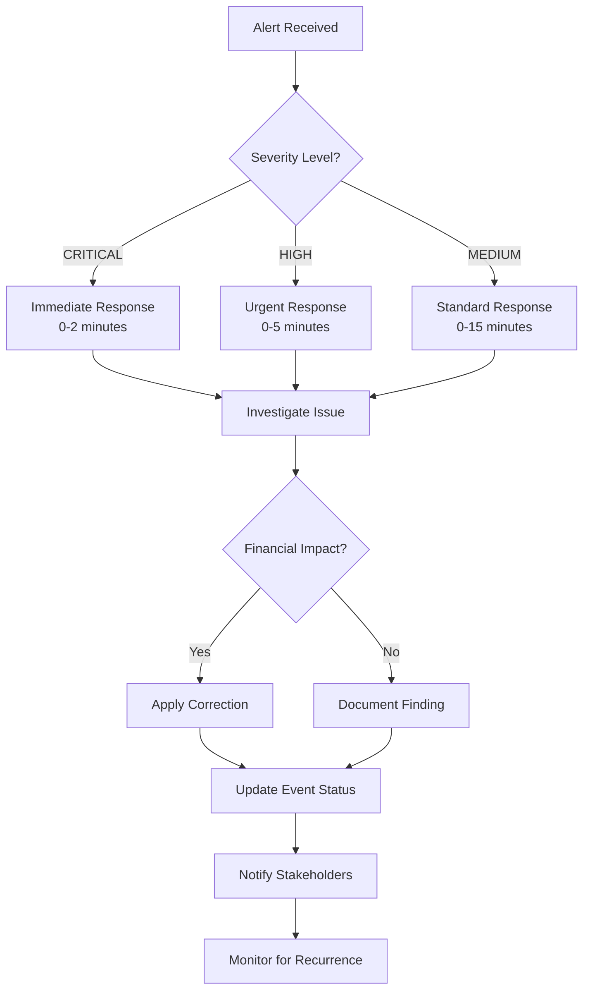

# Phase 4 Monitoring System - Operational Guide

## 🎯 Overview

This guide provides comprehensive operational procedures for managing the Phase 4 Production Monitoring System during festival operations. It covers daily monitoring tasks, alert response procedures, performance tuning, and troubleshooting for high-volume festival environments.

**Target Audience**: Festival operations team, system administrators, technical support  
**Environment**: Production festival (6,000+ daily transactions, 2,000 participants)  
**Operational Hours**: 24/7 during festival periods

## 📊 System Monitoring and Health Checks

### Daily Health Check Procedures

#### Morning Health Check (Pre-Festival Hours)

```bash
#!/bin/bash
# Daily morning health check script

echo "=== Phase 4 Monitoring System - Daily Health Check ==="
echo "Date: $(date)"
echo "Operator: $USER"

# 1. Check system health status
echo "1. Checking system health..."
curl -s -X GET "$SUPABASE_URL/functions/v1/monitoring-api/health" \
  -H "Authorization: Bearer $SUPABASE_SERVICE_ROLE_KEY" | jq '.status'

# 2. Check last 24 hours statistics
echo "2. Checking 24-hour statistics..."
psql "$DATABASE_URL" -c "
SELECT 
  COUNT(*) as total_events,
  COUNT(*) FILTER (WHERE severity = 'CRITICAL') as critical_events,
  COUNT(*) FILTER (WHERE status = 'OPEN') as open_events
FROM monitoring_events 
WHERE detection_timestamp > NOW() - INTERVAL '24 hours';"

# 3. Check system performance
echo "3. Checking system performance..."
psql "$DATABASE_URL" -c "
SELECT 
  avg_processing_time_ms,
  success_rate_percent,
  total_transactions_last_hour,
  overall_health_status
FROM system_health_snapshots 
ORDER BY snapshot_timestamp DESC 
LIMIT 1;"

# 4. Check circuit breaker status
echo "4. Checking circuit breaker status..."
curl -s -X GET "$SUPABASE_URL/functions/v1/monitoring/status" \
  -H "Authorization: Bearer $SUPABASE_SERVICE_ROLE_KEY" | jq '.circuit_breaker.state'

echo "=== Health Check Complete ==="
```

#### Real-Time Monitoring Dashboard

Access the monitoring dashboard at: `/admin` → Monitoring Tab

**Key Metrics to Monitor:**

| Metric | Normal Range | Warning Threshold | Critical Threshold |
|--------|--------------|-------------------|-------------------|
| **Transaction Success Rate** | >99% | <98% | <95% |
| **Detection Processing Time** | <3s | >5s | >10s |
| **Open Critical Events** | 0 | 1-2 | >3 |
| **System Health Status** | HEALTHY | WARNING | CRITICAL |
| **API Response Time** | <200ms | >500ms | >1000ms |

### Hourly Monitoring Tasks

#### Automated Monitoring Checks

The system performs automated checks every:
- **30 seconds**: Critical detection algorithms
- **2 minutes**: Medium priority detection
- **5 minutes**: System health snapshots
- **1 hour**: Data cleanup and maintenance

#### Manual Hourly Verification

```sql
-- Check recent monitoring activity
SELECT 
  event_type,
  severity,
  COUNT(*) as count,
  MAX(detection_timestamp) as last_detection
FROM monitoring_events 
WHERE detection_timestamp > NOW() - INTERVAL '1 hour'
GROUP BY event_type, severity
ORDER BY severity DESC, count DESC;

-- Verify detection functions are running
SELECT 
  snapshot_timestamp,
  total_transactions_last_hour,
  success_rate_percent,
  monitoring_events_last_hour
FROM system_health_snapshots 
ORDER BY snapshot_timestamp DESC 
LIMIT 3;
```

## 🚨 Alert Interpretation and Response Procedures

### Alert Severity Levels

#### CRITICAL Alerts - Immediate Response Required

**Response Time**: <2 minutes  
**Escalation**: Immediate notification to festival operations manager

##### Transaction Failure Alerts

**Alert**: "Balance deducted on failed transaction"
```
Event Type: transaction_failure
Severity: CRITICAL
Detection Algorithm: balance_deduction_on_failure
```

**Response Procedure**:
1. **Immediate Action** (0-2 minutes):
   ```sql
   -- Identify affected transaction
   SELECT * FROM monitoring_events 
   WHERE event_type = 'transaction_failure' 
   AND severity = 'CRITICAL' 
   AND status = 'OPEN'
   ORDER BY detection_timestamp DESC;
   
   -- Check transaction details
   SELECT * FROM app_transaction_log 
   WHERE transaction_id = 'AFFECTED_TRANSACTION_ID';
   ```

2. **Investigation** (2-5 minutes):
   - Verify card balance discrepancy
   - Check if customer was charged incorrectly
   - Review transaction processing logs

3. **Resolution** (5-15 minutes):
   ```sql
   -- If confirmed issue, create manual correction
   INSERT INTO app_transaction_log (
     transaction_id, card_id, transaction_type, status,
     amount_involved, previous_balance, new_balance,
     timestamp, details
   ) VALUES (
     gen_random_uuid(), 'AFFECTED_CARD_ID', 'manual_correction', 'completed',
     CORRECTION_AMOUNT, CURRENT_BALANCE, CORRECTED_BALANCE,
     NOW(), '{"reason": "Phase4_monitoring_correction", "original_transaction": "ORIGINAL_ID"}'
   );
   
   -- Update monitoring event status
   UPDATE monitoring_events 
   SET status = 'RESOLVED', 
       resolved_at = NOW(),
       resolution_notes = 'Manual correction applied'
   WHERE event_id = EVENT_ID;
   ```

##### Balance Discrepancy Alerts

**Alert**: "Card balance mismatch detected"
```
Event Type: balance_discrepancy
Severity: CRITICAL
Detection Algorithm: balance_mismatch_detection
```

**Response Procedure**:
1. **Immediate Verification**:
   ```sql
   -- Check current card balance vs expected
   WITH expected_balance AS (
     SELECT 
       card_id,
       SUM(CASE 
         WHEN transaction_type IN ('stripe_recharge', 'checkpoint_recharge') 
           AND status = 'completed' THEN amount_involved
         WHEN transaction_type = 'bar_order' 
           AND status = 'completed' THEN -amount_involved
         ELSE 0
       END) as calculated_balance
     FROM app_transaction_log
     WHERE card_id = 'AFFECTED_CARD_ID'
     GROUP BY card_id
   )
   SELECT 
     c.amount as actual_balance,
     eb.calculated_balance as expected_balance,
     c.amount - eb.calculated_balance as discrepancy
   FROM table_cards c
   JOIN expected_balance eb ON eb.card_id = c.id
   WHERE c.id = 'AFFECTED_CARD_ID';
   ```

2. **Root Cause Analysis**:
   - Review all transactions for the affected card
   - Check for failed transactions that may have affected balance
   - Verify no duplicate processing occurred

3. **Resolution**:
   - If discrepancy confirmed, adjust card balance
   - Document the correction in monitoring event
   - Notify customer if significant amount involved

#### HIGH Alerts - Response Required Within 5 Minutes

**Response Time**: <5 minutes  
**Escalation**: Notify technical team lead

##### Consecutive Transaction Failures

**Alert**: "Multiple consecutive failures for same card"

**Response Procedure**:
1. **Check Card Status**:
   ```sql
   -- Review recent failures for card
   SELECT * FROM app_transaction_log 
   WHERE card_id = 'AFFECTED_CARD_ID' 
   AND status = 'failed'
   AND timestamp > NOW() - INTERVAL '15 minutes'
   ORDER BY timestamp DESC;
   ```

2. **Investigate Cause**:
   - Check if card has sufficient balance
   - Verify NFC reader functionality at affected location
   - Review error patterns in transaction details

3. **Resolution**:
   - If card issue: Advise customer to visit recharge station
   - If system issue: Check NFC reader status and restart if needed
   - If pattern indicates broader issue: Escalate to technical team

#### MEDIUM Alerts - Response Required Within 15 Minutes

**Response Time**: <15 minutes  
**Escalation**: Log for review during next scheduled check

##### Duplicate NFC Scans

**Alert**: "Duplicate NFC scans detected"

**Response Procedure**:
1. **Verify Pattern**:
   ```sql
   -- Check scan pattern
   SELECT * FROM nfc_scan_log 
   WHERE card_id_scanned = 'AFFECTED_CARD_ID'
   AND scan_timestamp > NOW() - INTERVAL '5 minutes'
   ORDER BY scan_timestamp;
   ```

2. **Assess Impact**:
   - Check if duplicate scans resulted in duplicate charges
   - Verify debouncing system is working correctly

3. **Action**:
   - If no financial impact: Mark as resolved
   - If duplicate charges: Follow transaction correction procedure
   - If pattern indicates system issue: Escalate for technical review

### Alert Response Workflow



## ⚡ Performance Tuning Guidelines

### Real-Time Performance Monitoring

#### Key Performance Indicators

```sql
-- Monitor detection performance
SELECT 
  detection_algorithm,
  AVG(EXTRACT(EPOCH FROM (updated_at - created_at))) as avg_processing_time,
  COUNT(*) as events_processed,
  COUNT(*) FILTER (WHERE severity = 'CRITICAL') as critical_events
FROM monitoring_events 
WHERE created_at > NOW() - INTERVAL '1 hour'
GROUP BY detection_algorithm
ORDER BY avg_processing_time DESC;

-- Monitor database performance
SELECT 
  query,
  calls,
  total_exec_time,
  mean_exec_time,
  rows
FROM pg_stat_statements 
WHERE query LIKE '%monitoring_%'
ORDER BY mean_exec_time DESC
LIMIT 10;
```

#### Performance Optimization Actions

**If Detection Time > 5 seconds:**
```sql
-- Check for blocking queries
SELECT 
  pid,
  now() - pg_stat_activity.query_start AS duration,
  query 
FROM pg_stat_activity 
WHERE (now() - pg_stat_activity.query_start) > interval '5 minutes';

-- Analyze table statistics
ANALYZE monitoring_events;
ANALYZE system_health_snapshots;
ANALYZE app_transaction_log;
```

**If API Response Time > 500ms:**
```bash
# Check edge function performance
curl -w "@curl-format.txt" -s -X GET "$SUPABASE_URL/functions/v1/monitoring-api/health" \
  -H "Authorization: Bearer $SUPABASE_SERVICE_ROLE_KEY"

# Monitor function logs
supabase functions logs monitoring-api --follow
```

### Database Optimization

#### Daily Maintenance Tasks

```sql
-- Daily cleanup and optimization (run during low-traffic hours)
DO $$
BEGIN
  -- Clean up old monitoring data
  PERFORM cleanup_monitoring_data(30);
  
  -- Refresh materialized views
  PERFORM refresh_monitoring_views();
  
  -- Update table statistics
  ANALYZE monitoring_events;
  ANALYZE system_health_snapshots;
  ANALYZE alert_history;
  
  -- Check for unused indexes
  RAISE NOTICE 'Daily maintenance completed at %', NOW();
END $$;
```

#### Weekly Optimization Tasks

```sql
-- Weekly performance review (run during maintenance window)
-- Check index usage
SELECT 
  schemaname,
  tablename,
  indexname,
  idx_scan,
  idx_tup_read
FROM pg_stat_user_indexes 
WHERE tablename LIKE 'monitoring_%'
AND idx_scan = 0;

-- Check table bloat
SELECT 
  tablename,
  n_dead_tup,
  n_live_tup,
  ROUND(n_dead_tup::numeric / NULLIF(n_live_tup, 0) * 100, 2) as bloat_ratio
FROM pg_stat_user_tables 
WHERE tablename LIKE 'monitoring_%'
AND n_dead_tup > 1000;

-- Vacuum if needed
VACUUM ANALYZE monitoring_events;
```

### Scaling Considerations

#### High-Volume Festival Periods

**Expected Load Increases:**
- Transaction volume: 10x normal
- Detection frequency: Every 15 seconds for critical checks
- API requests: 5x normal dashboard usage

**Scaling Actions:**
```bash
# Increase edge function concurrency
supabase functions update monitoring --max-instances 10
supabase functions update monitoring-api --max-instances 5

# Optimize detection intervals for high load
export MONITORING_INTERVAL_CRITICAL=15000  # 15 seconds
export MONITORING_INTERVAL_MEDIUM=60000    # 1 minute
```

**Database Scaling:**
```sql
-- Increase connection limits temporarily
ALTER SYSTEM SET max_connections = 200;
SELECT pg_reload_conf();

-- Optimize for high-volume inserts
ALTER TABLE monitoring_events SET (fillfactor = 85);
ALTER TABLE system_health_snapshots SET (fillfactor = 85);
```

## 🔧 Maintenance Procedures

### Daily Maintenance Checklist

#### Morning Routine (Before Festival Opens)
- [ ] Run daily health check script
- [ ] Review overnight monitoring events
- [ ] Check system resource usage
- [ ] Verify all detection functions operational
- [ ] Test alert notification systems
- [ ] Review and resolve any open events

#### Evening Routine (After Festival Closes)
- [ ] Review daily monitoring summary
- [ ] Check performance metrics
- [ ] Run database maintenance
- [ ] Backup monitoring data
- [ ] Plan next day optimizations

### Weekly Maintenance Tasks

#### Performance Review
```sql
-- Weekly performance summary
SELECT 
  DATE_TRUNC('day', detection_timestamp) as day,
  COUNT(*) as total_events,
  COUNT(*) FILTER (WHERE severity = 'CRITICAL') as critical_events,
  AVG(confidence_score) as avg_confidence,
  COUNT(DISTINCT card_id) as affected_cards
FROM monitoring_events 
WHERE detection_timestamp > NOW() - INTERVAL '7 days'
GROUP BY day
ORDER BY day;
```

#### System Health Review
```sql
-- Weekly system health trends
SELECT 
  DATE_TRUNC('day', snapshot_timestamp) as day,
  AVG(success_rate_percent) as avg_success_rate,
  AVG(total_transactions_last_hour) as avg_hourly_transactions,
  COUNT(*) FILTER (WHERE overall_health_status = 'CRITICAL') as critical_hours
FROM system_health_snapshots 
WHERE snapshot_timestamp > NOW() - INTERVAL '7 days'
GROUP BY day
ORDER BY day;
```

### Monthly Maintenance Tasks

#### Capacity Planning Review
- Analyze growth trends in transaction volume
- Review detection algorithm performance
- Plan infrastructure scaling needs
- Update monitoring thresholds based on patterns

#### Security Review
- Review access logs for monitoring APIs
- Validate database permissions
- Check for any security alerts
- Update security documentation

## 🔍 Common Issues and Resolutions

### Issue: High False Positive Rate

**Symptoms**: Many monitoring events marked as false positives

**Investigation**:
```sql
-- Check false positive patterns
SELECT 
  event_type,
  detection_algorithm,
  COUNT(*) as total,
  COUNT(*) FILTER (WHERE status = 'FALSE_POSITIVE') as false_positives,
  ROUND(COUNT(*) FILTER (WHERE status = 'FALSE_POSITIVE')::numeric / COUNT(*) * 100, 2) as fp_rate
FROM monitoring_events 
WHERE detection_timestamp > NOW() - INTERVAL '7 days'
GROUP BY event_type, detection_algorithm
HAVING COUNT(*) FILTER (WHERE status = 'FALSE_POSITIVE') > 0
ORDER BY fp_rate DESC;
```

**Resolution**:
1. Adjust detection thresholds
2. Refine detection algorithms
3. Update confidence scoring
4. Improve context data collection

### Issue: Detection Delays

**Symptoms**: Events detected significantly after occurrence

**Investigation**:
```sql
-- Check detection delays
SELECT 
  event_type,
  detection_algorithm,
  AVG(EXTRACT(EPOCH FROM (detection_timestamp - created_at))) as avg_delay_seconds
FROM monitoring_events 
WHERE detection_timestamp > NOW() - INTERVAL '24 hours'
GROUP BY event_type, detection_algorithm
ORDER BY avg_delay_seconds DESC;
```

**Resolution**:
1. Check system resource usage
2. Optimize database queries
3. Review edge function performance
4. Consider increasing detection frequency

### Issue: Circuit Breaker Activation

**Symptoms**: Monitoring functions failing due to circuit breaker

**Investigation**:
```bash
# Check circuit breaker status
curl -s -X GET "$SUPABASE_URL/functions/v1/monitoring/status" \
  -H "Authorization: Bearer $SUPABASE_SERVICE_ROLE_KEY" | jq '.circuit_breaker'
```

**Resolution**:
1. Identify root cause of failures
2. Fix underlying issues
3. Reset circuit breaker if needed
4. Monitor for recurrence

### Issue: Database Performance Degradation

**Symptoms**: Slow query performance, high CPU usage

**Investigation**:
```sql
-- Check slow queries
SELECT 
  query,
  calls,
  total_exec_time,
  mean_exec_time,
  rows
FROM pg_stat_statements 
WHERE mean_exec_time > 1000  -- Queries taking > 1 second
ORDER BY mean_exec_time DESC;

-- Check blocking queries
SELECT 
  blocked_locks.pid AS blocked_pid,
  blocked_activity.usename AS blocked_user,
  blocking_locks.pid AS blocking_pid,
  blocking_activity.usename AS blocking_user,
  blocked_activity.query AS blocked_statement,
  blocking_activity.query AS current_statement_in_blocking_process
FROM pg_catalog.pg_locks blocked_locks
JOIN pg_catalog.pg_stat_activity blocked_activity ON blocked_activity.pid = blocked_locks.pid
JOIN pg_catalog.pg_locks blocking_locks ON blocking_locks.locktype = blocked_locks.locktype
JOIN pg_catalog.pg_stat_activity blocking_activity ON blocking_activity.pid = blocking_locks.pid
WHERE NOT blocked_locks.granted;
```

**Resolution**:
1. Optimize slow queries
2. Add missing indexes
3. Update table statistics
4. Consider query rewriting

## 📈 Monitoring System Monitoring (Meta-Monitoring)

### Monitoring the Monitoring System

#### Health Check Automation

Create automated monitoring of the monitoring system:

```bash
#!/bin/bash
# Meta-monitoring script - monitors the monitoring system itself

# Check if monitoring functions are responsive
HEALTH_CHECK=$(curl -s -w "%{http_code}" -X GET "$SUPABASE_URL/functions/v1/monitoring/health" \
  -H "Authorization: Bearer $SUPABASE_SERVICE_ROLE_KEY")

if [[ "${HEALTH_CHECK: -3}" != "200" ]]; then
  echo "ALERT: Monitoring system health check failed"
  # Send alert to operations team
fi

# Check if detection cycles are running
LAST_CYCLE=$(psql "$DATABASE_URL" -t -c "
SELECT EXTRACT(EPOCH FROM (NOW() - MAX(detection_timestamp)))
FROM monitoring_events 
WHERE event_type = 'system_health';")

if (( $(echo "$LAST_CYCLE > 600" | bc -l) )); then
  echo "ALERT: No system health events in last 10 minutes"
  # Send alert to operations team
fi
```

#### Performance Monitoring

```sql
-- Monitor monitoring system performance
CREATE OR REPLACE VIEW monitoring_system_health AS
SELECT 
  'detection_performance' as metric,
  AVG(EXTRACT(EPOCH FROM (updated_at - created_at))) as value,
  'seconds' as unit
FROM monitoring_events 
WHERE created_at > NOW() - INTERVAL '1 hour'
UNION ALL
SELECT 
  'events_per_hour' as metric,
  COUNT(*)::numeric as value,
  'count' as unit
FROM monitoring_events 
WHERE detection_timestamp > NOW() - INTERVAL '1 hour'
UNION ALL
SELECT 
  'critical_events_ratio' as metric,
  COUNT(*) FILTER (WHERE severity = 'CRITICAL')::numeric / NULLIF(COUNT(*), 0) * 100 as value,
  'percentage' as unit
FROM monitoring_events 
WHERE detection_timestamp > NOW() - INTERVAL '24 hours';
```

## 📚 Operational Procedures Reference

### Quick Reference Commands

#### Emergency Procedures
```bash
# Stop monitoring system
supabase functions delete monitoring
supabase functions delete monitoring-api

# Restart monitoring system
supabase functions deploy monitoring
supabase functions deploy monitoring-api

# Force detection cycle
curl -X POST "$SUPABASE_URL/functions/v1/monitoring/cycle" \
  -H "Authorization: Bearer $SUPABASE_SERVICE_ROLE_KEY"

# Check system status
curl -X GET "$SUPABASE_URL/functions/v1/monitoring/status" \
  -H "Authorization: Bearer $SUPABASE_SERVICE_ROLE_KEY"
```

#### Data Recovery
```sql
-- Recover from monitoring event corruption
BEGIN;
-- Backup current state
CREATE TABLE monitoring_events_backup AS SELECT * FROM monitoring_events;
-- Apply corrections
-- COMMIT or ROLLBACK based on results
```

### Contact Information

#### Escalation Matrix

| Issue Severity | Contact | Response Time | Contact Method |
|---------------|---------|---------------|----------------|
| **CRITICAL** | Festival Operations Manager | <2 minutes | Phone + SMS |
| **HIGH** | Technical Team Lead | <5 minutes | SMS + Slack |
| **MEDIUM** | Support Team | <15 minutes | Slack + Email |
| **LOW** | Development Team | <1 hour | Email |

#### Emergency Contacts
- **Festival Operations**: +33 X XX XX XX XX
- **Technical Lead**: +33 X XX XX XX XX  
- **Database Admin**: +33 X XX XX XX XX
- **Supabase Support**: support@supabase.io

## 📋 Operational Checklists

### Festival Start Checklist
- [ ] All monitoring functions operational
- [ ] Dashboard accessible to operations team
- [ ] Alert notifications configured
- [ ] Performance baselines established
- [ ] Emergency procedures reviewed
- [ ] Contact information updated

### Festival End Checklist
- [ ] Final monitoring report generated
- [ ] Performance metrics documented
- [ ] Issues and resolutions logged
- [ ] Data backup completed
- [ ] System optimization recommendations prepared
- [ ] Post-event review scheduled

This operational guide ensures smooth day-to-day management of the Phase 4 Monitoring System, providing the procedures and knowledge needed to maintain optimal system performance and rapid response to any issues that may arise during festival operations.